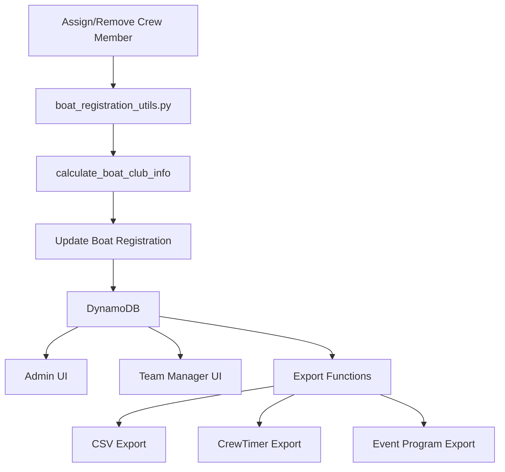

# Design Document: Boat Club Display

## Overview

This design implements a simple and practical approach to displaying boat club information throughout the Impressionnistes registration system. The core principle is: **always show the registering club (team manager's club) first**, with additional context about crew composition when needed.

The implementation adds two new calculated fields to boat registrations:
- `boat_club_display`: A string showing the team manager's club with optional suffix indicating crew composition
- `club_list`: An array of unique club names present in the crew

**Display Format (Option A):**
- `"RCPM"` → All crew from team manager's club (or no crew yet)
- `"RCPM (Multi-Club)"` → Crew from multiple clubs
- `"RCPM (Club Elite)"` → All crew from a single club different from team manager

These fields are automatically calculated and updated whenever crew assignments change, ensuring club information is always accurate and up-to-date.

## Architecture

### High-Level Flow

```
Crew Assignment Change
    ↓
Calculate Club Information
    ↓
Update boat_club_display & club_list
    ↓
Store in Database
    ↓
Display in UI / Export to Files
```

### Component Interaction



## Components and Interfaces

### Backend Components

#### 1. Club Calculation Utility (`functions/shared/boat_registration_utils.py`)

**New Function: `calculate_boat_club_info`**

```python
def calculate_boat_club_info(
    crew_members: List[Dict[str, Any]], 
    team_manager_club: str
) -> Dict[str, Any]:
    """
    Calculate boat club display and club list from crew members
    
    Args:
        crew_members: List of assigned crew member objects with club_affiliation
        team_manager_club: Team manager's club affiliation (fallback)
    
    Returns:
        Dictionary with:
        - boat_club_display: str (club name or "Multi-Club")
        - club_list: List[str] (unique clubs, sorted alphabetically)
    """
```

**Logic:**
1. Extract all non-empty club affiliations from crew members
2. Normalize clubs to uppercase for comparison
3. Get unique clubs (case-insensitive)
4. Determine display format:
   - If 0 unique crew clubs: use team_manager_club
   - If 1 unique crew club == team_manager_club: use team_manager_club
   - If 1 unique crew club != team_manager_club: use "{team_manager_club} ({crew_club})"
   - If 2+ unique crew clubs: use "{team_manager_club} (Multi-Club)"
5. Build club_list with original case, sorted alphabetically

#### 2. Updated Functions

**`assign_seat.py`**: Add club calculation after seat assignment
**`update_boat_registration.py`**: Add club calculation after boat update
**`create_boat_registration.py`**: Initialize club fields on creation
**`admin_update_boat.py`**: Add club calculation for admin updates
**`update_crew_member.py`**: Trigger recalculation when crew member club changes

#### 3. Database Schema Updates

**Boat Registration Schema** (`validation.py`):

```python
boat_registration_schema = {
    # ... existing fields ...
    'boat_club_display': {
        'type': 'string',
        'required': False,
        'nullable': True
    },
    'club_list': {
        'type': 'list',
        'required': False,
        'schema': {
            'type': 'string'
        }
    }
}
```

### Frontend Components

#### 1. Admin Boats Page (`frontend/src/views/admin/AdminBoats.vue`)

**Changes:**
- Replace `boat.team_manager_club` with `boat.boat_club_display` in display
- Add tooltip/popover component for "Multi-Club" entries
- Update club filter to search both `boat_club_display` and `club_list`
- Update sorting to use `boat_club_display`

**UI Enhancement:**
```vue
<template>
  <div class="club-display">
    <span v-if="!boat.boat_club_display.includes('(')">
      {{ boat.boat_club_display }}
    </span>
    <span v-else class="club-badge" @click="showClubList(boat)">
      {{ boat.boat_club_display }}
      <InfoIcon />
    </span>
  </div>
</template>
```

#### 2. Club List Popover Component (`frontend/src/components/ClubListPopover.vue`)

**New Component:**
- Shows list of clubs when "Multi-Club" is clicked or hovered
- Displays clubs in a clean, readable format
- Can be used in both admin and team manager interfaces

#### 3. Team Manager Boats View

**Changes:**
- Display `boat_club_display` instead of team manager's club
- Show club list for multi-club crews in boat details

### Export Components

#### 1. CSV Export (`frontend/src/utils/exportFormatters/boatRegistrationsFormatter.js`)

**Changes:**
- Add "Club" column with `boat_club_display`
- Add "Club List" column with `club_list.join('; ')`
- Keep "Team Manager Club" column for reference

**Example Output:**
```csv
Boat ID,Club,Club List,Team Manager Club,...
boat-123,RCPM,RCPM,RCPM,...
boat-456,RCPM (Multi-Club),RCPM; Club Elite; SN Versailles,RCPM,...
boat-789,RCPM (Club Elite),Club Elite,RCPM,...
```

#### 2. CrewTimer Export (`frontend/src/utils/exportFormatters/crewTimerFormatter.js`)

**Changes:**
- Replace club calculation logic with `boat.boat_club_display`
- Remove fallback to `boat.club_affiliation` (dead code)
- Simplify to: `const clubName = boat.boat_club_display || 'Unknown'`

**Example Output:**
```
Event Time,Event Num,Event,Crew,Stroke,Bow,...
7:00:00 AM,1,Master Women 4X+,RCPM,Dupont,1,...
7:02:00 AM,1,Master Women 4X+,RCPM (Multi-Club),Martin,2,...
7:04:00 AM,1,Master Women 4X+,RCPM (Club Elite),Bernard,3,...
```

#### 3. Event Program Export (`frontend/src/utils/exportFormatters/eventProgramFormatter.js`)

**Changes:**
- Use `boat.boat_club_display` for club field
- No translation needed ("Multi-Club" works in both French and English)

## Data Models

### Boat Registration (Updated)

```typescript
interface BoatRegistration {
  // Existing fields
  boat_registration_id: string
  team_manager_id: string
  event_type: '21km' | '42km'
  boat_type: 'skiff' | '4-' | '4+' | '8+'
  race_id: string | null
  seats: Seat[]
  is_boat_rental: boolean
  is_multi_club_crew: boolean  // Kept for backward compatibility
  registration_status: 'incomplete' | 'complete' | 'free' | 'paid'
  
  // New fields
  boat_club_display: string  // Club name or "Multi-Club"
  club_list: string[]        // Array of unique clubs
  
  // Metadata
  created_at: string
  updated_at: string
}
```

### Crew Member (Unchanged)

```typescript
interface CrewMember {
  crew_member_id: string
  team_manager_id: string
  first_name: string
  last_name: string
  date_of_birth: string
  gender: 'M' | 'F'
  license_number: string
  club_affiliation: string  // Used for club calculation
  is_rcpm_member: boolean
  assigned_boat_id: string | null
}
```

## Correctness Properties

*A property is a characteristic or behavior that should hold true across all valid executions of a system—essentially, a formal statement about what the system should do. Properties serve as the bridge between human-readable specifications and machine-verifiable correctness guarantees.*

### Property 1: Single Club Display - Team Manager's Club

*For any* boat registration where all assigned crew members have the same club_affiliation as the team manager (case-insensitive), the boat_club_display SHALL equal the team manager's club name (preserving original case)

**Validates: Requirements 1.1**

### Property 2: Multi-Club Display

*For any* boat registration where assigned crew members have two or more different club_affiliations (case-insensitive), the boat_club_display SHALL equal "{team_manager_club} (Multi-Club)"

**Validates: Requirements 1.2**

### Property 3: Single Club Display - External Crew

*For any* boat registration where all assigned crew members belong to a single club different from the team manager's club (case-insensitive), the boat_club_display SHALL equal "{team_manager_club} ({crew_club})"

**Validates: Requirements 1.3**

### Property 4: Empty Boat Fallback

*For any* boat registration with no assigned crew members, the boat_club_display SHALL equal the team manager's club_affiliation

**Validates: Requirements 1.4**

### Property 4: Club List Uniqueness

*For any* boat registration, the club_list SHALL contain each unique club name exactly once

**Validates: Requirements 2.1, 2.2**

### Property 5: Club List Sorting

*For any* boat registration, the club_list SHALL be sorted alphabetically (case-insensitive)

**Validates: Requirements 2.4**

### Property 6: Club List Completeness

*For any* boat registration with assigned crew members, the club_list SHALL contain all unique non-empty club_affiliations from those crew members

**Validates: Requirements 2.1, 2.2**

### Property 7: Multi-Club Consistency

*For any* boat registration where boat_club_display contains "(Multi-Club)", the is_multi_club_crew field SHALL be true

**Validates: Requirements 10.2**

### Property 8: Single Club Consistency

*For any* boat registration where boat_club_display does not contain "(Multi-Club)", the is_multi_club_crew field SHALL be false

**Validates: Requirements 10.3**

### Property 9: Club Calculation Idempotence

*For any* boat registration, calculating club information twice with the same crew members SHALL produce identical boat_club_display and club_list values

**Validates: Requirements 1.1, 1.2, 1.3, 2.1**

### Property 10: Case Insensitive Comparison

*For any* two crew members with club_affiliations that differ only in case (e.g., "RCPM" and "rcpm"), they SHALL be considered as belonging to the same club for boat_club_display calculation

**Validates: Requirements 1.5**

### Property 11: Empty Club Exclusion

*For any* boat registration, crew members with empty or null club_affiliation SHALL not contribute to the club_list

**Validates: Requirements 1.6, 2.2**

### Property 12: Recalculation on Assignment

*For any* boat registration, when a crew member is assigned to or removed from a seat, the boat_club_display and club_list SHALL be recalculated

**Validates: Requirements 3.3**

## Error Handling

### Validation Errors

1. **Invalid Club Data**: If club calculation fails, log error and use team manager's club as fallback
2. **Missing Team Manager Club**: If team manager has no club and boat has no crew, use empty string
3. **Database Update Failure**: If club fields fail to save, log error but don't block seat assignment

### Edge Cases

1. **All Empty Clubs**: If all crew members have empty clubs, use team manager's club
2. **Null vs Empty String**: Treat null and empty string as equivalent (both excluded)
3. **Whitespace-Only Clubs**: Trim whitespace before comparison
4. **Very Long Club Names**: No truncation, display full name (CSS handles overflow)

### Error Messages

- "Unable to calculate club information" - Generic calculation error
- "Club information may be outdated" - If recalculation fails after crew update

## Testing Strategy

### Unit Tests

**Backend (`test_boat_club_calculation.py`):**
- Test `calculate_boat_club_info` with various crew compositions
- Test single club scenarios
- Test multi-club scenarios
- Test empty crew scenarios
- Test case-insensitive comparison
- Test empty/null club handling
- Test club list sorting

**Frontend (`clubDisplay.test.js`):**
- Test club display rendering
- Test "Multi-Club" badge rendering
- Test club list popover
- Test filtering by club
- Test sorting by club

### Property-Based Tests

**Backend (`test_boat_club_properties.py`):**
- Generate random crew compositions
- Verify all correctness properties hold
- Test with 100+ iterations per property
- Use hypothesis library for Python

**Test Configuration:**
- Minimum 100 iterations per property test
- Tag format: **Feature: boat-club-display, Property {number}: {property_text}**

### Integration Tests

**API Tests (`test_boat_club_api.py`):**
- Test seat assignment updates club fields
- Test boat update recalculates clubs
- Test crew member club update triggers recalculation
- Test export endpoints include correct club data

### Manual Testing Checklist

- [ ] Assign crew from single club, verify display
- [ ] Assign crew from multiple clubs, verify "Multi-Club" display
- [ ] Hover/click "Multi-Club", verify club list appears
- [ ] Filter boats by club name
- [ ] Sort boats by club
- [ ] Export to CSV, verify club columns
- [ ] Export to CrewTimer, verify club field
- [ ] Update crew member's club, verify boat updates
- [ ] Remove all crew, verify fallback to team manager club

## Migration Strategy

### Database Migration

**Migration Script** (`functions/migrations/calculate_boat_clubs.py`):

1. Scan all boat registrations
2. For each boat:
   - Fetch assigned crew members
   - Fetch team manager
   - Calculate `boat_club_display` and `club_list`
   - Update boat registration
3. Log progress and any errors
4. Verify all boats have club fields populated

**Execution:**
```bash
cd infrastructure
make db-migrate MIGRATION=calculate_boat_clubs TEAM_MANAGER_ID=admin-user-id
```

### Rollout Plan

1. **Phase 1: Backend Implementation**
   - Add club calculation function
   - Update seat assignment logic
   - Add database fields
   - Deploy to dev environment

2. **Phase 2: Data Migration**
   - Run migration script on dev database
   - Verify data correctness
   - Run migration on production database

3. **Phase 3: Frontend Implementation**
   - Update admin boats page
   - Add club list popover
   - Update team manager interface
   - Deploy to dev environment

4. **Phase 4: Export Updates**
   - Update CSV export
   - Update CrewTimer export
   - Update event program export
   - Test all export formats

5. **Phase 5: Production Deployment**
   - Deploy backend changes
   - Deploy frontend changes
   - Monitor for errors
   - Verify club display in production

### Backward Compatibility

- Keep `is_multi_club_crew` field (set automatically based on `boat_club_display`)
- Keep `team_manager_club` in exports for reference
- Ensure existing API responses include new fields without breaking clients
- Frontend gracefully handles boats without club fields (shows team manager club as fallback)

## Performance Considerations

### Calculation Performance

- Club calculation is O(n) where n = number of crew members (max 9)
- Set operations for uniqueness are O(n)
- Sorting is O(n log n) but n is small (typically 1-3 clubs)
- Overall: Negligible performance impact

### Database Impact

- Two new fields per boat registration
- String field: ~20-50 bytes average
- Array field: ~50-150 bytes average
- Total: ~100-200 bytes per boat
- For 1000 boats: ~100-200 KB additional storage (negligible)

### Query Performance

- No new indexes needed
- Filtering by club uses existing scan (no performance change)
- Sorting by club is in-memory (no database impact)

### Caching Strategy

- No caching needed (calculation is fast)
- Club fields are stored, not calculated on-the-fly
- Frontend receives pre-calculated values from API
