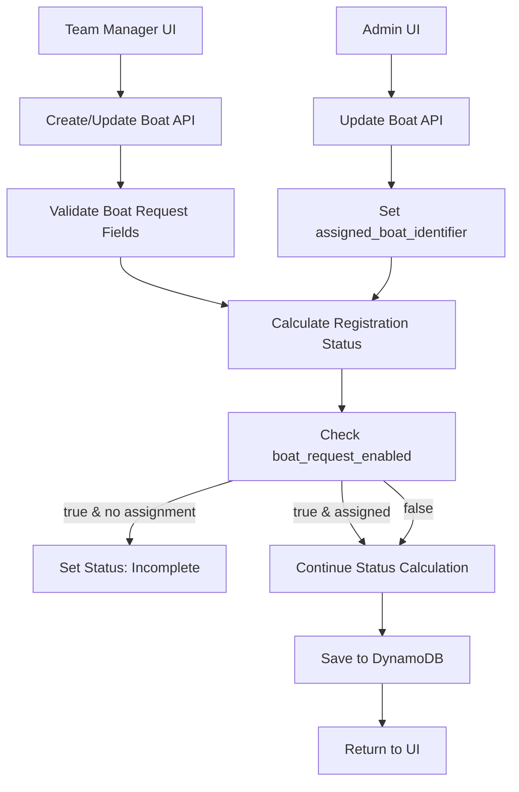

# Design Document: Boat Hull Assignment Request

## Overview

This design implements an optional boat (hull) assignment request feature for crew registrations. Team managers can indicate they need a physical boat from the organization, provide details about their requirements, and see which boat has been assigned by administrators. Crews with pending boat requests remain incomplete until a boat is assigned.

The feature adds four new fields to boat registrations:
- `boat_request_enabled`: Boolean toggle to enable/disable the request
- `boat_request_comment`: Free-text field for team manager to describe requirements (max 500 chars)
- `assigned_boat_identifier`: Read-only field showing the assigned boat name/number (set by admin, max 100 chars)
- `assigned_boat_comment`: Read-only field showing admin's comment about the assignment (set by admin, max 500 chars)

## Architecture

### High-Level Flow

```
Team Manager Creates/Edits Crew
    ↓
Optionally Enable Boat Request
    ↓
Enter Boat Request Comment (optional)
    ↓
Save Crew Registration
    ↓
Check Completion Status
    ↓
(If boat_request_enabled && !assigned_boat_identifier)
    → Status: Incomplete
    ↓
Admin Views Crew with Boat Request
    ↓
Admin Assigns Boat (enters name/number)
    ↓
Update assigned_boat_identifier
    ↓
Recalculate Completion Status
    ↓
Team Manager Sees Assigned Boat
```

### Component Interaction



## Components and Interfaces

### Backend Components

#### 1. Database Schema Updates (`functions/shared/validation.py`)

Add four new fields to `boat_registration_schema`:

```python
boat_registration_schema = {
    # ... existing fields ...
    
    # NEW FIELDS
    'boat_request_enabled': {
        'type': 'boolean',
        'required': False,
        'default': False
    },
    'boat_request_comment': {
        'type': 'string',
        'required': False,
        'nullable': True,
        'maxlength': 500
    },
    'assigned_boat_identifier': {
        'type': 'string',
        'required': False,
        'nullable': True,
        'maxlength': 100
    },
    'assigned_boat_comment': {
        'type': 'string',
        'required': False,
        'nullable': True,
        'maxlength': 500
    }
}
```


#### 2. Completion Status Logic Update (`functions/shared/boat_registration_utils.py`)

Update `is_registration_complete` function to check boat request status:

```python
def is_registration_complete(boat_registration: Dict[str, Any]) -> bool:
    """
    Check if a boat registration is complete
    
    A registration is complete when:
    - All seats have crew members assigned
    - A race has been selected
    - If boat request is enabled, a boat must be assigned
    
    Args:
        boat_registration: Boat registration dictionary
    
    Returns:
        True if registration is complete
    """
    # Check if race is selected
    if not boat_registration.get('race_id'):
        return False
    
    # Check if all seats are filled
    seats = boat_registration.get('seats', [])
    for seat in seats:
        if not seat.get('crew_member_id'):
            return False
    
    # NEW: Check boat request status
    boat_request_enabled = boat_registration.get('boat_request_enabled', False)
    if boat_request_enabled:
        assigned_boat_identifier = boat_registration.get('assigned_boat_identifier')
        if not assigned_boat_identifier or not assigned_boat_identifier.strip():
            # Boat request is enabled but no boat assigned yet
            return False
    
    return True
```

#### 3. Create Boat Registration (`functions/boat/create_boat_registration.py`)

Initialize new fields when creating a boat:

```python
boat_registration_item = {
    # ... existing fields ...
    
    # NEW FIELDS - Initialize to defaults
    'boat_request_enabled': body.get('boat_request_enabled', False),
    'boat_request_comment': body.get('boat_request_comment'),
    'assigned_boat_identifier': None,  # Always null on creation
    'assigned_boat_comment': None,  # Always null on creation
    
    # ... rest of fields ...
}

# Clear boat request fields if boat_request_enabled is False
if not boat_registration_item['boat_request_enabled']:
    boat_registration_item['boat_request_comment'] = None
    boat_registration_item['assigned_boat_identifier'] = None
    boat_registration_item['assigned_boat_comment'] = None
```

#### 4. Update Boat Registration (`functions/boat/update_boat_registration.py`)

Handle boat request field updates:

```python
# Allow updating boat request fields
if 'boat_request_enabled' in body:
    updates['boat_request_enabled'] = body['boat_request_enabled']
    
    # If disabling boat request, clear related fields
    if not body['boat_request_enabled']:
        updates['boat_request_comment'] = None
        updates['assigned_boat_identifier'] = None
        updates['assigned_boat_comment'] = None

if 'boat_request_comment' in body:
    # Only allow if boat_request_enabled is true
    if updates.get('boat_request_enabled', existing_boat.get('boat_request_enabled')):
        comment = body['boat_request_comment']
        if comment:
            # Sanitize and validate length
            comment = sanitize_string(comment, max_length=500)
        updates['boat_request_comment'] = comment
    else:
        return validation_error({
            'boat_request_comment': 'Cannot set comment when boat request is disabled'
        })

# Team managers cannot update assigned_boat_identifier or assigned_boat_comment (admin only)
# These will be handled in admin_update_boat.py
```

#### 5. Admin Update Boat (`functions/admin/admin_update_boat.py`)

Allow admins to assign boats:

```python
# Admin can update assigned_boat_identifier
if 'assigned_boat_identifier' in body:
    boat_name = body['assigned_boat_identifier']
    if boat_name:
        # Sanitize and validate
        boat_name = sanitize_string(boat_name, max_length=100)
        if len(boat_name) > 100:
            return validation_error({
                'assigned_boat_identifier': 'Boat name cannot exceed 100 characters'
            })
    updates['assigned_boat_identifier'] = boat_name

# Admin can update assigned_boat_comment
if 'assigned_boat_comment' in body:
    boat_comment = body['assigned_boat_comment']
    if boat_comment:
        # Sanitize and validate
        boat_comment = sanitize_string(boat_comment, max_length=500)
        if len(boat_comment) > 500:
            return validation_error({
                'assigned_boat_comment': 'Boat comment cannot exceed 500 characters'
            })
    updates['assigned_boat_comment'] = boat_comment

# After updates, recalculate registration status
updated_boat = {**existing_boat, **updates}
new_status = calculate_registration_status(updated_boat, assigned_crew_members)
updates['registration_status'] = new_status
```


### Frontend Components

#### 1. Boat Registration Form (`frontend/src/components/BoatRegistrationForm.vue`)

Add boat request section to the form:

```vue
<template>
  <form @submit.prevent="handleSubmit">
    <!-- Existing fields: event_type, boat_type, race_id, etc. -->
    
    <!-- NEW: Boat Request Section -->
    <div class="form-section">
      <h3>{{ $t('boat.boatRequest.title') }}</h3>
      
      <div class="form-group">
        <label class="checkbox-label">
          <input 
            type="checkbox" 
            v-model="formData.boat_request_enabled"
            @change="handleBoatRequestToggle"
          />
          <span>{{ $t('boat.boatRequest.enableLabel') }}</span>
        </label>
        <p class="help-text">{{ $t('boat.boatRequest.helpText') }}</p>
      </div>
      
      <!-- Show these fields only when boat request is enabled -->
      <div v-if="formData.boat_request_enabled" class="boat-request-fields">
        <div class="form-group">
          <label for="boat_request_comment">
            {{ $t('boat.boatRequest.commentLabel') }}
          </label>
          <textarea
            id="boat_request_comment"
            v-model="formData.boat_request_comment"
            :placeholder="$t('boat.boatRequest.commentPlaceholder')"
            maxlength="500"
            rows="4"
            class="form-textarea"
          ></textarea>
          <span class="char-count">
            {{ formData.boat_request_comment?.length || 0 }} / 500
          </span>
        </div>
        
        <div class="form-group">
          <label>{{ $t('boat.boatRequest.assignedBoatLabel') }}</label>
          <input
            type="text"
            :value="formData.assigned_boat_identifier || $t('boat.boatRequest.notAssigned')"
            disabled
            class="form-input read-only"
          />
          <p class="help-text">{{ $t('boat.boatRequest.assignedBoatHelp') }}</p>
        </div>
        
        <div v-if="formData.assigned_boat_comment" class="form-group">
          <label>{{ $t('boat.boatRequest.assignedBoatCommentLabel') }}</label>
          <div class="assigned-comment">
            {{ formData.assigned_boat_comment }}
          </div>
        </div>
      </div>
    </div>
    
    <!-- Rest of form -->
  </form>
</template>

<script>
export default {
  data() {
    return {
      formData: {
        event_type: '',
        boat_type: '',
        race_id: null,
        boat_request_enabled: false,
        boat_request_comment: '',
        assigned_boat_identifier: null,
        assigned_boat_comment: null,
        // ... other fields
      }
    }
  },
  methods: {
    handleBoatRequestToggle() {
      if (!this.formData.boat_request_enabled) {
        // Clear fields when disabling
        this.formData.boat_request_comment = ''
        // Note: assigned_boat_identifier and assigned_boat_comment are read-only, backend will clear them
      }
    },
    
    async handleSubmit() {
      const payload = {
        event_type: this.formData.event_type,
        boat_type: this.formData.boat_type,
        race_id: this.formData.race_id,
        boat_request_enabled: this.formData.boat_request_enabled,
        boat_request_comment: this.formData.boat_request_comment,
        // Don't send assigned_boat_identifier or assigned_boat_comment (read-only for team managers)
      }
      
      // Submit to API
      await this.boatStore.createBoatRegistration(payload)
    }
  }
}
</script>

<style scoped>
.boat-request-fields {
  margin-top: 1rem;
  padding: 1rem;
  background-color: #f8f9fa;
  border-radius: 4px;
}

.form-textarea {
  width: 100%;
  padding: 0.5rem;
  border: 1px solid #ddd;
  border-radius: 4px;
  font-family: inherit;
  resize: vertical;
}

.read-only {
  background-color: #e9ecef;
  cursor: not-allowed;
  color: #6c757d;
}

.char-count {
  display: block;
  text-align: right;
  font-size: 0.875rem;
  color: #6c757d;
  margin-top: 0.25rem;
}

.assigned-comment {
  padding: 0.75rem;
  background-color: #e7f3ff;
  border-left: 4px solid #007bff;
  border-radius: 4px;
  white-space: pre-wrap;
  font-size: 0.9rem;
}
</style>
```

#### 2. Boats List View (`frontend/src/views/Boats.vue`)

Display boat request status in the list:

```vue
<template>
  <!-- Card View -->
  <div class="boat-card">
    <!-- Existing fields -->
    
    <!-- NEW: Boat Request Status -->
    <div v-if="boat.boat_request_enabled" class="detail-row">
      <span class="label">{{ $t('boat.boatRequest.status') }}&nbsp;:</span>
      <span v-if="boat.assigned_boat_identifier" class="boat-assigned">
        {{ boat.assigned_boat_identifier }}
      </span>
      <span v-else class="boat-pending">
        {{ $t('boat.boatRequest.waitingAssignment') }}
      </span>
    </div>
    
    <!-- NEW: Admin's Assignment Comment (Card View - Direct Display) -->
    <div v-if="boat.boat_request_enabled && boat.assigned_boat_comment" class="detail-row">
      <span class="label">{{ $t('boat.boatRequest.assignmentDetails') }}&nbsp;:</span>
      <span class="assignment-comment">{{ boat.assigned_boat_comment }}</span>
    </div>
  </div>
</template>

<style scoped>
.boat-assigned {
  color: #28a745;
  font-weight: 600;
}

.boat-pending {
  color: #ffc107;
  font-style: italic;
}

.assignment-comment {
  font-size: 0.9rem;
  color: #495057;
  font-style: italic;
}
</style>
```


#### 3. Admin Boats View (`frontend/src/views/admin/AdminBoats.vue`)

Add boat request column and assignment interface:

```vue
<template>
  <table class="admin-boats-table">
    <thead>
      <tr>
        <th>Boat #</th>
        <th>Event</th>
        <th>Type</th>
        <th>Status</th>
        <!-- NEW COLUMN -->
        <th>Boat Request</th>
        <th>Actions</th>
      </tr>
    </thead>
    <tbody>
      <tr v-for="boat in boats" :key="boat.boat_registration_id">
        <td>{{ boat.boat_number || '-' }}</td>
        <td>{{ boat.event_type }}</td>
        <td>{{ boat.boat_type }}</td>
        <td>{{ boat.registration_status }}</td>
        
        <!-- NEW: Boat Request Column -->
        <td>
          <span v-if="!boat.boat_request_enabled" class="no-request">
            -
          </span>
          <span 
            v-else-if="boat.assigned_boat_identifier" 
            class="boat-assigned"
            :title="boat.assigned_boat_comment || ''"
          >
            {{ boat.assigned_boat_identifier }}
            <span v-if="boat.assigned_boat_comment" class="info-icon">ℹ️</span>
          </span>
          <span v-else class="boat-requested">
            Requested
          </span>
        </td>
        
        <td>
          <button @click="viewBoat(boat)">View</button>
          <button @click="editBoat(boat)">Edit</button>
        </td>
      </tr>
    </tbody>
  </table>
  
  <!-- Edit Modal -->
  <div v-if="editingBoat" class="modal">
    <div class="modal-content">
      <h2>Edit Boat Registration</h2>
      
      <!-- Existing fields -->
      
      <!-- NEW: Boat Assignment Section (only if boat_request_enabled) -->
      <div v-if="editingBoat.boat_request_enabled" class="boat-assignment-section">
        <h3>Boat Assignment</h3>
        
        <div v-if="editingBoat.boat_request_comment" class="request-comment">
          <label>Team Manager's Request:</label>
          <p>{{ editingBoat.boat_request_comment }}</p>
        </div>
        
        <div class="form-group">
          <label for="assigned_boat_identifier">Assign Boat (Name/Number):</label>
          <input
            id="assigned_boat_identifier"
            v-model="editForm.assigned_boat_identifier"
            type="text"
            maxlength="100"
            placeholder="e.g., Boat 42, Elite Shell, etc."
            class="form-input"
          />
          <p class="help-text">
            Enter the boat name or number to assign. Leave empty to unassign.
          </p>
        </div>
        
        <div class="form-group">
          <label for="assigned_boat_comment">Assignment Details (Optional):</label>
          <textarea
            id="assigned_boat_comment"
            v-model="editForm.assigned_boat_comment"
            maxlength="500"
            rows="3"
            placeholder="e.g., Hull location, oar rack number, special instructions..."
            class="form-textarea"
          ></textarea>
          <span class="char-count">
            {{ editForm.assigned_boat_comment?.length || 0 }} / 500
          </span>
          <p class="help-text">
            Optional details about where to find the boat, oars, or other instructions.
          </p>
        </div>
      </div>
      
      <div class="modal-actions">
        <button @click="saveBoat">Save</button>
        <button @click="cancelEdit">Cancel</button>
      </div>
    </div>
  </div>
</template>

<script>
export default {
  data() {
    return {
      editingBoat: null,
      editForm: {
        assigned_boat_identifier: '',
        assigned_boat_comment: ''
      }
    }
  },
  methods: {
    editBoat(boat) {
      this.editingBoat = boat
      this.editForm.assigned_boat_identifier = boat.assigned_boat_identifier || ''
      this.editForm.assigned_boat_comment = boat.assigned_boat_comment || ''
    },
    
    async saveBoat() {
      const updates = {
        assigned_boat_identifier: this.editForm.assigned_boat_identifier.trim() || null,
        assigned_boat_comment: this.editForm.assigned_boat_comment.trim() || null
      }
      
      await this.adminStore.updateBoat(
        this.editingBoat.boat_registration_id,
        updates
      )
      
      this.editingBoat = null
    }
  }
}
</script>

<style scoped>
.no-request {
  color: #6c757d;
}

.boat-requested {
  color: #ffc107;
  font-weight: 600;
}

.boat-assigned {
  color: #28a745;
  font-weight: 600;
}

.request-comment {
  padding: 1rem;
  background-color: #f8f9fa;
  border-left: 4px solid #007bff;
  margin-bottom: 1rem;
}

.request-comment label {
  font-weight: 600;
  display: block;
  margin-bottom: 0.5rem;
}

.request-comment p {
  margin: 0;
  white-space: pre-wrap;
}

.info-icon {
  margin-left: 0.25rem;
  cursor: help;
}

.form-textarea {
  width: 100%;
  padding: 0.5rem;
  border: 1px solid #ddd;
  border-radius: 4px;
  font-family: inherit;
  resize: vertical;
}

.char-count {
  display: block;
  text-align: right;
  font-size: 0.875rem;
  color: #6c757d;
  margin-top: 0.25rem;
}
</style>
```

## Pricing Calculation

### Pricing Logic Update (`functions/shared/pricing.py`)

The boat request feature affects pricing calculation. The system must determine whether a crew is using an RCPM boat based on the boat request status:

```python
def calculate_boat_pricing(
    boat_registration: Dict[str, Any],
    crew_members: List[Dict[str, Any]],
    pricing_config: Optional[Dict[str, Any]] = None
) -> Dict[str, Any]:
    """
    Calculate complete pricing for a boat registration
    
    Pricing Components:
    - base_seat_price: Participation Fee per external club member (RCPM = €0)
    - rental_price_crew: Boat Rental fee per seat for non-RCPM members using RCPM boats
    
    Boat Request Logic:
    - If boat_request_enabled=false: Crew using own boat → Participation Fee only
    - If boat_request_enabled=true AND assigned_boat_identifier is set: Crew using RCPM boat → Participation Fee + Boat Rental
    - If boat_request_enabled=true AND assigned_boat_identifier is null: Crew incomplete → No pricing calculated
    """
    # ... existing pricing config setup ...
    
    # Determine if crew is using RCPM boat
    boat_request_enabled = boat_registration.get('boat_request_enabled', False)
    assigned_boat_identifier = boat_registration.get('assigned_boat_identifier')
    is_using_rcpm_boat = boat_request_enabled and assigned_boat_identifier and assigned_boat_identifier.strip()
    
    # Calculate base price (Participation Fee for external members only)
    # ... existing base price calculation ...
    
    # Calculate rental fee if using RCPM boat
    if is_using_rcpm_boat:
        if boat_type == 'skiff':
            # Skiff rental: 2.5x base price
            rental_fee = base_seat_price * rental_multiplier_skiff
            pricing['rental_fee'] = rental_fee
            pricing['breakdown'].append({
                'item': 'Skiff rental',
                'unit_price': base_seat_price * rental_multiplier_skiff,
                'quantity': 1,
                'amount': rental_fee
            })
        else:
            # Crew boat rental: rental_price_crew per seat for non-RCPM members
            external_seats = sum(1 for seat in filled_seats 
                               if not is_rcpm_member(crew_lookup.get(seat.get('crew_member_id'), {}).get('club_affiliation', '')))
            rental_fee = rental_price_crew * external_seats
            pricing['rental_fee'] = rental_fee
            pricing['breakdown'].append({
                'item': f'Boat rental ({external_seats} external seats)',
                'unit_price': rental_price_crew,
                'quantity': external_seats,
                'amount': rental_fee
            })
    
    # Calculate total
    pricing['total'] = pricing['base_price'] + pricing['rental_fee']
    
    return pricing
```

**Key Changes:**
- Replace `is_boat_rental` check with `boat_request_enabled AND assigned_boat_identifier` check
- Only calculate rental fees when boat is actually assigned (not just requested)
- Boat Rental fee applies only to non-RCPM members (RCPM members pay €0 for both Participation Fee and Boat Rental)

## Data Models

### Boat Registration (Updated)

```typescript
interface BoatRegistration {
  // Existing fields
  boat_registration_id: string
  team_manager_id: string
  event_type: '42km' | '21km'
  boat_type: 'skiff' | '4-' | '4+' | '8+'
  race_id: string | null
  boat_number: string | null
  seats: Seat[]
  is_boat_rental: boolean
  registration_status: 'incomplete' | 'complete' | 'free' | 'paid'
  boat_club_display: string
  club_list: string[]
  is_multi_club_crew: boolean
  
  // NEW FIELDS
  boat_request_enabled: boolean  // Default: false
  boat_request_comment: string | null  // Max 500 chars
  assigned_boat_identifier: string | null  // Max 100 chars
  assigned_boat_comment: string | null  // Max 500 chars (admin's comment about assignment)
  
  // Metadata
  created_at: string
  updated_at: string
}
```

### Validation Rules

```python
# In validation.py
boat_registration_schema = {
    # ... existing fields ...
    
    'boat_request_enabled': {
        'type': 'boolean',
        'required': False,
        'default': False
    },
    'boat_request_comment': {
        'type': 'string',
        'required': False,
        'nullable': True,
        'maxlength': 500
    },
    'assigned_boat_identifier': {
        'type': 'string',
        'required': False,
        'nullable': True,
        'maxlength': 100
    },
    'assigned_boat_comment': {
        'type': 'string',
        'required': False,
        'nullable': True,
        'maxlength': 500
    }
}
```

**Field Descriptions:**
- `boat_request_enabled`: Boolean flag indicating if team manager wants an RCPM boat assigned
- `boat_request_comment`: Team manager's description of boat requirements (e.g., "Beginner level", "boat #42")
- `assigned_boat_identifier`: Admin-assigned boat identifier (name or number)
- `assigned_boat_comment`: Admin's comment about the assignment (e.g., "Hull in rack 3, oars in locker B")


## Correctness Properties

*A property is a characteristic or behavior that should hold true across all valid executions of a system—essentially, a formal statement about what the system should do. Properties serve as the bridge between human-readable specifications and machine-verifiable correctness guarantees.*

### Property Reflection

After analyzing all acceptance criteria, I identified the following testable properties. Some criteria were combined to eliminate redundancy:

- Properties 1.4 and 1.5 can be combined into a single round-trip property (Property 1)
- Properties 2.3 and 2.6 are both round-trip properties and can be combined (Property 2)
- Properties 4.1, 4.2, and 4.3 all test completion logic and can be combined (Property 3)
- Properties 8.3 and 8.5 are both about admin assignment persistence and can be combined (Property 6)
- Properties 8.4 and 8.6 both test completion recalculation and can be combined (Property 7)

### Property 1: Boat Request Enabled Round Trip

*For any* crew registration, saving and then retrieving the crew SHALL preserve the boat_request_enabled value exactly as it was set

**Validates: Requirements 1.4, 1.5, 1.6**

### Property 2: Boat Request Comment Round Trip

*For any* crew registration with boat_request_enabled=true and a boat_request_comment (including line breaks and special characters), saving and then retrieving the crew SHALL preserve the comment exactly as it was entered

**Validates: Requirements 2.3, 2.6**

### Property 3: Completion Status with Boat Request

*For any* crew registration:
- If boat_request_enabled=true AND assigned_boat_identifier is null or empty, the crew SHALL be incomplete (regardless of other factors)
- If boat_request_enabled=true AND assigned_boat_identifier has a value, completion SHALL depend on other factors (seats filled, race selected)
- If boat_request_enabled=false, assigned_boat_identifier SHALL NOT affect completion status

**Validates: Requirements 4.1, 4.2, 4.3**

### Property 4: Boat Request Comment Length Validation

*For any* string up to 500 characters, when used as boat_request_comment with boat_request_enabled=true, the system SHALL accept it; for any string over 500 characters, the system SHALL reject it with a validation error

**Validates: Requirements 2.2**

### Property 5: Assigned Boat Name Length Validation

*For any* string up to 100 characters, when used as assigned_boat_identifier, the system SHALL accept it; for any string over 100 characters, the system SHALL reject it with a validation error

**Validates: Requirements 5.3**

### Property 6: Admin Boat Assignment Persistence

*For any* crew registration with boat_request_enabled=true, when an administrator sets assigned_boat_identifier to a valid value, saving and then retrieving the crew SHALL preserve the assigned boat name exactly as it was set

**Validates: Requirements 8.3, 8.5**

### Property 7: Completion Recalculation on Assignment

*For any* crew registration with boat_request_enabled=true:
- When assigned_boat_identifier changes from null to a non-empty value, AND all other completion criteria are met (seats filled, race selected), the crew SHALL become complete
- When assigned_boat_identifier changes from a non-empty value to null, the crew SHALL become incomplete

**Validates: Requirements 8.4, 8.6**

### Property 8: Boat Request Disabled Clears Fields

*For any* crew registration, when boat_request_enabled changes from true to false, both boat_request_comment and assigned_boat_identifier SHALL be set to null

**Validates: Requirements 2.4, 5.4**

### Property 9: Team Manager Cannot Modify Assigned Boat

*For any* crew registration, when a team manager (non-admin) attempts to update assigned_boat_identifier, the system SHALL reject the request with an authorization error

**Validates: Requirements 3.4**

### Property 10: Payment Prevention for Pending Requests

*For any* crew registration with boat_request_enabled=true and assigned_boat_identifier=null, payment operations SHALL be rejected

**Validates: Requirements 4.6**

### Property 11: Assigned Boat Name Character Acceptance

*For any* string containing alphanumeric characters, spaces, and common punctuation (. , - / # etc.), when used as assigned_boat_identifier, the system SHALL accept it

**Validates: Requirements 8.2, 8.7**

### Property 12: Whitespace Trimming

*For any* assigned_boat_identifier value with leading or trailing whitespace, the system SHALL trim the whitespace before saving

**Validates: Requirements 9.6**

### Property 13: XSS Sanitization

*For any* boat_request_comment containing potentially dangerous characters (< > & " '), the system SHALL sanitize them to prevent XSS attacks while preserving the readable content

**Validates: Requirements 9.5**

### Property 14: Paid Crew Boat Request Protection

*For any* crew registration with registration_status='paid' and assigned_boat_identifier set, attempting to disable boat_request_enabled SHALL be rejected

**Validates: Requirements 12.1**


## Error Handling

### Validation Errors

1. **Comment Too Long**: If boat_request_comment exceeds 500 characters, return validation error: "Boat request comment cannot exceed 500 characters"
2. **Assigned Boat Name Too Long**: If assigned_boat_identifier exceeds 100 characters, return validation error: "Assigned boat name cannot exceed 100 characters"
3. **Assigned Boat Comment Too Long**: If assigned_boat_comment exceeds 500 characters, return validation error: "Assigned boat comment cannot exceed 500 characters"
4. **Unauthorized Assignment**: If team manager attempts to set assigned_boat_identifier or assigned_boat_comment, return 403 error: "Only administrators can assign boats"
5. **Payment with Pending Request**: If payment attempted with pending boat request, return error: "Cannot process payment while boat assignment is pending"
6. **Disable Request on Paid Crew**: If attempting to disable boat request on paid crew with assignment, return error: "Cannot disable boat request for paid crew with assigned boat"

### Edge Cases

1. **Empty String vs Null**: Treat empty strings as null for assigned_boat_identifier (trim and convert)
2. **Line Breaks in Comment**: Preserve line breaks (\n, \r\n) in boat_request_comment
3. **Special Characters**: Sanitize HTML/script tags but preserve other special characters
4. **Concurrent Admin Updates**: Use optimistic locking or last-write-wins for admin assignments
5. **Missing Fields on Old Data**: Default boat_request_enabled to false for existing crews

### Error Messages

- "Boat request comment cannot exceed 500 characters"
- "Assigned boat name cannot exceed 100 characters"
- "Assigned boat comment cannot exceed 500 characters"
- "Only administrators can assign boats to crew requests"
- "Cannot process payment while boat assignment is pending"
- "Cannot disable boat request for paid crew with assigned boat"
- "Boat request fields are only available when boat request is enabled"

## Testing Strategy

### Unit Tests

**Backend (`test_boat_request_validation.py`):**
- Test boat_request_comment length validation (valid and invalid)
- Test assigned_boat_identifier length validation (valid and invalid)
- Test field clearing when boat_request_enabled is disabled
- Test whitespace trimming for assigned_boat_identifier
- Test XSS sanitization for boat_request_comment
- Test default values for new crews

**Backend (`test_boat_request_completion.py`):**
- Test completion status with pending boat request
- Test completion status with assigned boat
- Test completion status with boat request disabled
- Test completion recalculation after assignment
- Test completion recalculation after unassignment

**Backend (`test_boat_request_authorization.py`):**
- Test team manager cannot set assigned_boat_identifier
- Test admin can set assigned_boat_identifier
- Test payment prevention with pending request
- Test boat request disable protection for paid crews

**Frontend (`boatRequestForm.test.js`):**
- Test toggle shows/hides boat request fields
- Test character counter for comment field
- Test assigned boat field is read-only
- Test form submission includes boat request fields

### Property-Based Tests

**Backend (`test_boat_request_properties.py`):**
- Generate random crew registrations with various boat request states
- Verify all correctness properties hold
- Test with 100+ iterations per property
- Use hypothesis library for Python

**Test Configuration:**
- Minimum 100 iterations per property test
- Tag format: **Feature: boat-hull-assignment-request, Property {number}: {property_text}**

### Integration Tests

**API Tests (`test_boat_request_api.py`):**
- Test create crew with boat request enabled
- Test update crew to enable boat request
- Test update crew to disable boat request
- Test admin assigns boat to request
- Test admin changes boat assignment
- Test admin removes boat assignment
- Test team manager cannot assign boat
- Test payment blocked with pending request

### Manual Testing Checklist

- [ ] Create crew with boat request enabled
- [ ] Enter boat request comment with special characters
- [ ] Verify assigned boat field is read-only for team manager
- [ ] Admin assigns boat to crew request
- [ ] Verify crew becomes complete after assignment
- [ ] Admin changes boat assignment
- [ ] Admin removes boat assignment
- [ ] Verify crew becomes incomplete after removal
- [ ] Disable boat request on crew
- [ ] Verify fields are cleared
- [ ] Try to disable boat request on paid crew with assignment
- [ ] Verify error message
- [ ] View boat request status in boats list
- [ ] View boat request in admin interface
- [ ] Filter crews by boat request status
- [ ] Export crews with boat request data

## Migration Strategy

### Database Migration

No migration script needed. The new fields are nullable and have default values:
- `boat_request_enabled`: Defaults to false
- `boat_request_comment`: Defaults to null
- `assigned_boat_identifier`: Defaults to null
- `assigned_boat_comment`: Defaults to null

Existing crews will automatically have boat_request_enabled=false, which means the feature is disabled for them by default.

### Rollout Plan

1. **Phase 1: Backend Implementation**
   - Add new fields to validation schema
   - Update is_registration_complete logic
   - Update create_boat_registration to initialize fields
   - Update update_boat_registration to handle fields
   - Update admin_update_boat to allow boat assignment
   - Deploy to dev environment

2. **Phase 2: Backend Testing**
   - Run unit tests
   - Run property-based tests
   - Run integration tests
   - Verify API behavior in dev

3. **Phase 3: Frontend Implementation**
   - Add boat request section to BoatRegistrationForm
   - Update Boats list view to show boat request status
   - Update admin boats view to show boat request column
   - Add boat assignment interface in admin edit modal
   - Deploy to dev environment

4. **Phase 4: Frontend Testing**
   - Test boat request toggle
   - Test comment entry and character limit
   - Test assigned boat display
   - Test admin assignment interface
   - Verify responsive design on mobile

5. **Phase 5: Integration Testing**
   - Test full flow: create crew → enable request → admin assigns → crew complete
   - Test edge cases and error scenarios
   - Test backward compatibility with existing crews

6. **Phase 6: Production Deployment**
   - Deploy backend changes
   - Deploy frontend changes
   - Monitor for errors
   - Verify feature works in production

### Backward Compatibility

- Existing crews without boat request fields will have boat_request_enabled=false by default
- API responses include new fields (null for old crews)
- Frontend gracefully handles missing fields
- No breaking changes to existing API contracts

## Performance Considerations

### Database Impact

- **New fields**: 3 additional fields per crew registration
  - boat_request_enabled: 1 byte (boolean)
  - boat_request_comment: ~0-500 bytes (string)
  - assigned_boat_identifier: ~0-100 bytes (string)
- **Total**: ~0-600 bytes additional per crew
- **For 1000 crews**: ~0-600 KB additional storage (negligible)

### Query Performance

- **No new indexes needed**: Fields are not queried directly
- **Filtering by boat request status**: In-memory filter in admin UI (acceptable)
- **Completion calculation**: Adds one additional check (negligible impact)

### API Performance

- **Create/Update operations**: No measurable impact (simple field assignments)
- **Completion calculation**: O(1) additional check
- **Admin assignment**: Single field update (fast)

## Security Considerations

- **XSS Prevention**: Sanitize boat_request_comment to remove script tags
- **Authorization**: Only admins can set assigned_boat_identifier
- **Input Validation**: Enforce length limits on all text fields
- **SQL Injection**: Not applicable (using DynamoDB with parameterized queries)
- **Data Integrity**: Validate boat_request_enabled state before allowing field updates

## Future Enhancements

1. **Boat Inventory Management**: Replace text input with dropdown selection from boat inventory
2. **Automated Assignment**: Algorithm to automatically suggest boat assignments based on crew requirements
3. **Boat Availability Calendar**: Show which boats are available for which time slots
4. **Email Notifications**: Notify team managers when boat is assigned
5. **Boat Request History**: Track all assignment changes for audit purposes
6. **Boat Specifications**: Store boat specifications (weight class, condition, etc.) for better matching
7. **Request Priority**: Allow marking urgent boat requests
8. **Bulk Assignment**: Admin tool to assign multiple boats at once

