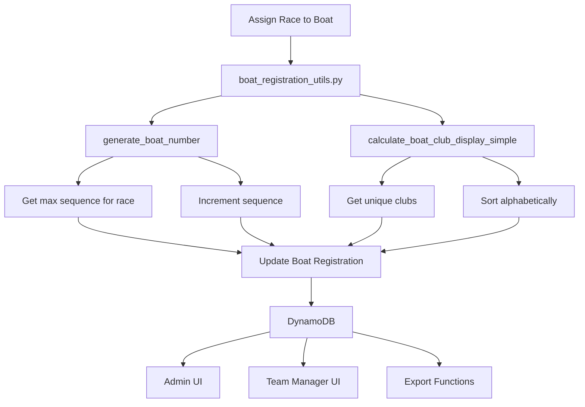

# Design Document: Boat Identifier and Simplified Club List

## Overview

This design implements two related enhancements to boat registrations:

1. **Simplified Club Display**: Replace the complex formatted club display ("RCPM (Multi-Club)") with a simple comma-separated list of unique clubs ("Club Elite, RCPM, SN Versailles")

2. **Boat Number Identifier**: Add a unique, human-readable identifier for each boat in the format `[M/SM].[display_order].[sequence]` (e.g., "M.1.3", "SM.15.42")

These changes simplify the user interface, remove unnecessary complexity, and provide a clear way to reference boats during race organization and timing.

## Architecture

### High-Level Flow

```
Race Assignment
    ↓
Generate Boat Number ──────┐
    ↓                      │
Calculate Club List ───────┤
    ↓                      │
Update Boat Registration ──┘
    ↓
Store in Database
    ↓
Display in UI / Export
```

### Component Interaction



## Components and Interfaces

### Backend Components

#### 1. Boat Number Generation (`functions/shared/boat_registration_utils.py`)

**New Function: `generate_boat_number`**

```python
def generate_boat_number(
    event_type: str,
    display_order: int,
    race_id: str,
    all_boats_in_race: List[Dict[str, Any]]
) -> str:
    """
    Generate a unique boat number for a race
    
    Args:
        event_type: '42km' or '21km'
        display_order: Race display order (1-55)
        race_id: Race ID to generate number for
        all_boats_in_race: All boats currently in this race
    
    Returns:
        Boat number string (e.g., "M.1.3" or "SM.15.42")
    """
    # Determine prefix
    prefix = "M" if event_type == "42km" else "SM"
    
    # Find highest sequence number in this race
    max_sequence = 0
    for boat in all_boats_in_race:
        boat_num = boat.get('boat_number', '')
        if boat_num:
            # Parse sequence from boat_number (e.g., "SM.15.42" -> 42)
            parts = boat_num.split('.')
            if len(parts) == 3:
                try:
                    sequence = int(parts[2])
                    max_sequence = max(max_sequence, sequence)
                except ValueError:
                    pass
    
    # Increment for new boat
    new_sequence = max_sequence + 1
    
    # Format: [M/SM].[display_order].[sequence]
    return f"{prefix}.{display_order}.{new_sequence}"
```

**Key Design Decisions:**
- **Never reuse sequence numbers**: Simpler logic, stable identifiers
- **Gaps are acceptable**: If boat 3 is deleted, next boat is still 5 (not 3)
- **Parse existing boat_numbers**: Handles migration and edge cases
- **Simple integer sequence**: No leading zeros, easy to read and communicate

#### 2. Simplified Club Display (`functions/shared/boat_registration_utils.py`)

**Updated Function: `calculate_boat_club_info`**

```python
def calculate_boat_club_info(
    crew_members: List[Dict[str, Any]], 
    team_manager_club: str
) -> Dict[str, Any]:
    """
    Calculate simplified boat club display and club list
    
    Args:
        crew_members: List of assigned crew member objects with club_affiliation
        team_manager_club: Team manager's club affiliation (fallback)
    
    Returns:
        Dictionary with:
        - boat_club_display: str (comma-separated list of clubs)
        - club_list: List[str] (unique clubs, sorted alphabetically)
        - is_multi_club_crew: bool (True if more than one club)
    """
    # Extract all non-empty club affiliations
    club_map = {}  # normalized -> original
    
    for member in crew_members:
        club_affiliation = member.get('club_affiliation')
        if club_affiliation is None:
            continue
        club_original = club_affiliation.strip()
        if club_original:
            club_normalized = club_original.upper()
            if club_normalized not in club_map:
                club_map[club_normalized] = club_original
    
    # Build club_list (sorted alphabetically, case-insensitive)
    club_list = sorted(club_map.values(), key=lambda x: x.upper()) if club_map else []
    
    # If no crew clubs, use team manager's club
    if not club_list:
        team_manager_club_clean = team_manager_club.strip() if team_manager_club else ''
        if team_manager_club_clean:
            club_list = [team_manager_club_clean]
    
    # Create comma-separated display
    boat_club_display = ', '.join(club_list) if club_list else ''
    
    # Determine if multi-club
    is_multi_club_crew = len(club_list) > 1
    
    return {
        'boat_club_display': boat_club_display,
        'club_list': club_list,
        'is_multi_club_crew': is_multi_club_crew
    }
```

**Key Changes from Old Logic:**
- **Removed team manager priority**: No longer shows "{TM_club} (Multi-Club)"
- **Pure alphabetical sorting**: All clubs treated equally
- **Simple comma separation**: Easy to read and parse
- **No special formatting**: No parentheses or suffixes

#### 3. Updated Functions

**`assign_seat.py`**: 
- Recalculate club display after seat assignment (existing logic, updated function)

**`update_boat_registration.py`**: 
- Recalculate club display after boat update (existing logic, updated function)
- Generate boat_number when race is assigned
- Clear boat_number when race is removed

**`select_race.py`** (if exists) or **`update_boat_registration.py`**:
- Generate boat_number when race is selected
- Query all boats in the same race to determine sequence
- Store boat_number in boat registration

**`admin_update_boat.py`**:
- Regenerate boat_number if race changes
- Recalculate club display if crew changes

#### 4. Database Schema Updates

**Boat Registration Schema** (`validation.py`):

```python
boat_registration_schema = {
    # ... existing fields ...
    'boat_club_display': {
        'type': 'string',
        'required': False,
        'nullable': True,
        'maxlength': 500  # Accommodate long club lists
    },
    'club_list': {
        'type': 'list',
        'required': False,
        'schema': {
            'type': 'string'
        }
    },
    'boat_number': {  # NEW FIELD
        'type': 'string',
        'required': False,
        'nullable': True,
        'maxlength': 20,  # "SM.55.9999" = 11 chars max
        'regex': '^(M|SM)\\.[0-9]{1,2}\\.[0-9]{1,4}$'  # Validate format
    },
    'is_multi_club_crew': {
        'type': 'boolean',
        'required': False,
        'default': False
    }
}
```

### Frontend Components

#### 1. Admin Boats Page (`frontend/src/views/admin/AdminBoats.vue`)

**Changes:**
- **Remove ClubListPopover**: No longer needed with simple comma list
- **Display boat_club_display directly**: No special handling for multi-club
- **Add boat_number column**: New column showing boat identifier
- **Update sorting**: Add boat_number sort option
- **Update filtering**: Allow filtering by boat_number

**UI Layout:**
```vue
<template>
  <table>
    <thead>
      <tr>
        <th @click="sortBy('boat_number')">Boat #</th>
        <th @click="sortBy('boat_club_display')">Club(s)</th>
        <th>Race</th>
        <!-- other columns -->
      </tr>
    </thead>
    <tbody>
      <tr v-for="boat in boats" :key="boat.boat_registration_id">
        <td>{{ boat.boat_number || '-' }}</td>
        <td>{{ boat.boat_club_display }}</td>
        <td>{{ boat.race_name }}</td>
        <!-- other columns -->
      </tr>
    </tbody>
  </table>
</template>
```

#### 2. Team Manager Boats View (`frontend/src/views/Boats.vue`)

**Changes:**
- Display boat_number prominently in boat cards
- Show simplified club list
- Remove multi-club indicator logic

**UI Enhancement:**
```vue
<div class="boat-card">
  <div class="boat-header">
    <h3>{{ boat.event_type }} {{ boat.boat_type }}</h3>
    <span class="boat-number-badge">{{ boat.boat_number || 'No race' }}</span>
  </div>
  <div class="boat-details">
    <p><strong>Club(s):</strong> {{ boat.boat_club_display }}</p>
    <p><strong>Race:</strong> {{ boat.race_name }}</p>
  </div>
</div>
```

#### 3. Remove ClubListPopover Component

**Action:**
- Delete `frontend/src/components/ClubListPopover.vue`
- Remove all imports and usages
- Simplify club display logic throughout frontend

### Export Components

#### 1. CSV Export (`frontend/src/utils/exportFormatters/boatRegistrationsFormatter.js`)

**Changes:**
- Add "Boat Number" column
- Update "Club" column to use simplified boat_club_display
- Keep "Club List" column (semicolon-separated for compatibility)

**Example Output:**
```csv
Boat Number,Club,Club List,Race,...
M.1.1,RCPM,RCPM,1X MASTER F WOMAN,...
M.1.2,Club Elite; RCPM,Club Elite; RCPM,1X MASTER F WOMAN,...
SM.15.3,Club Elite; RCPM; SN Versailles,Club Elite; RCPM; SN Versailles,WOMEN-MASTER-COXED QUAD SCULL YOLETTE,...
```

#### 2. CrewTimer Export (`frontend/src/utils/exportFormatters/crewTimerFormatter.js`)

**Changes:**
- Use boat_number for "Bow" field (boat identifier in timing system)
- Use simplified boat_club_display for "Crew" field
- Fallback to sequential number if boat_number is missing

**Example Output:**
```
Event Time,Event Num,Event,Crew,Bow,Stroke,...
7:00:00 AM,1,Master Women 4X+,RCPM,M.1.1,Dupont,...
7:02:00 AM,1,Master Women 4X+,Club Elite; RCPM,M.1.2,Martin,...
```

#### 3. Event Program Export (`frontend/src/utils/exportFormatters/eventProgramFormatter.js`)

**Changes:**
- Include boat_number in program layout
- Use simplified boat_club_display for club field
- Format for readability in printed programs

## Data Models

### Boat Registration (Updated)

```typescript
interface BoatRegistration {
  // Existing fields
  boat_registration_id: string
  team_manager_id: string
  event_type: '42km' | '21km'
  boat_type: 'skiff' | '4-' | '4+' | '8+' | '4x-' | '4x+' | '8x+'
  race_id: string | null
  seats: Seat[]
  is_boat_rental: boolean
  registration_status: 'incomplete' | 'complete' | 'free' | 'paid'
  
  // Updated fields
  boat_club_display: string  // NOW: "Club A, Club B, Club C" (comma-separated)
  club_list: string[]        // Unchanged: ["Club A", "Club B", "Club C"]
  is_multi_club_crew: boolean  // NOW: true if club_list.length > 1
  
  // New field
  boat_number: string | null  // "M.1.3" or "SM.15.42" or null
  
  // Metadata
  created_at: string
  updated_at: string
}
```

### Race (Unchanged, for reference)

```typescript
interface Race {
  race_id: string
  event_type: '42km' | '21km'
  boat_type: string
  age_category: string
  gender_category: string
  master_category: string | null
  display_order: number  // USED FOR BOAT NUMBER
  name: string
  short_name: string
}
```

## Correctness Properties

*A property is a characteristic or behavior that should hold true across all valid executions of a system—essentially, a formal statement about what the system should do. Properties serve as the bridge between human-readable specifications and machine-verifiable correctness guarantees.*

### Property 1: Boat Number Format

*For any* boat with an assigned race, the boat_number SHALL match the format `^(M|SM)\.[0-9]{1,2}\.[0-9]{1,4}$`

**Validates: Requirements 2.1, 2.2, 2.3, 14.1, 14.3, 14.4, 14.5**

### Property 2: Boat Number Prefix - Marathon

*For any* boat assigned to a 42km race, the boat_number SHALL start with "M."

**Validates: Requirements 2.2**

### Property 3: Boat Number Prefix - Semi-Marathon

*For any* boat assigned to a 21km race, the boat_number SHALL start with "SM."

**Validates: Requirements 2.3**

### Property 4: Boat Number Display Order

*For any* boat with an assigned race, the second component of boat_number SHALL equal the race's display_order

**Validates: Requirements 2.4**

### Property 5: Boat Number Uniqueness

*For any* two boats assigned to the same race, their boat_number values SHALL be different

**Validates: Requirements 3.1, 3.5**

### Property 6: Boat Number Sequence Increment

*For any* race, when a new boat is assigned, its sequence number SHALL be greater than all existing sequence numbers in that race

**Validates: Requirements 3.1, 3.4**

### Property 7: Boat Number Null When No Race

*For any* boat without an assigned race (race_id is null), the boat_number SHALL be null

**Validates: Requirements 2.9, 4.2**

### Property 8: Club Display Comma Separation

*For any* boat with multiple clubs in club_list, the boat_club_display SHALL contain commas separating the club names

**Validates: Requirements 1.1, 1.2**

### Property 9: Club Display Alphabetical Order

*For any* boat with multiple clubs, the clubs in boat_club_display SHALL appear in alphabetical order (case-insensitive)

**Validates: Requirements 1.5**

### Property 10: Club Display Matches Club List

*For any* boat, the clubs in boat_club_display SHALL exactly match the clubs in club_list (same clubs, same order)

**Validates: Requirements 1.1, 1.7**

### Property 11: Multi-Club Flag Consistency

*For any* boat, is_multi_club_crew SHALL be true if and only if club_list has more than one element

**Validates: Requirements 11.5, 12.2, 12.3, 12.4**

### Property 12: Empty Club Fallback

*For any* boat with no crew members having clubs, the boat_club_display SHALL equal the team manager's club

**Validates: Requirements 1.4, 13.5**

### Property 13: Boat Number Regeneration on Race Change

*For any* boat, when the race_id changes, the boat_number SHALL be recalculated to match the new race

**Validates: Requirements 2.8, 4.4**

## Error Handling

### Validation Errors

1. **Invalid Race**: If race doesn't exist when generating boat_number, return error and set boat_number to null
2. **Missing Display Order**: If race has no display_order, log error and use 0 as fallback
3. **Boat Number Generation Failure**: If generation fails, log error, set boat_number to null, allow boat to save
4. **Club Calculation Failure**: If club calculation fails, use team manager's club as fallback

### Edge Cases

1. **Race Display Order Changes**: Recalculate all boat_numbers for affected race
2. **Concurrent Boat Assignments**: Use database transaction or optimistic locking to prevent duplicate sequences
3. **Very Long Club Lists**: Truncate boat_club_display if it exceeds 500 characters (rare)
4. **Special Characters in Club Names**: Preserve as-is, no escaping needed for comma-separated format
5. **Deleted Boats**: Sequence numbers are never reused, gaps are acceptable

### Error Messages

- "Unable to generate boat number: race not found"
- "Boat number generation failed, please try again"
- "Club information may be outdated"

## Testing Strategy

### Unit Tests

**Backend (`test_boat_number_generation.py`):**
- Test boat_number format for marathon races
- Test boat_number format for semi-marathon races
- Test sequence number increment
- Test handling of gaps in sequence numbers
- Test boat_number is null when no race
- Test boat_number regeneration on race change

**Backend (`test_club_display_simple.py`):**
- Test single club display
- Test multiple clubs comma-separated
- Test alphabetical sorting
- Test empty crew fallback
- Test case-insensitive comparison
- Test empty/null club exclusion

**Frontend (`boatNumber.test.js`):**
- Test boat_number display in admin interface
- Test boat_number display in team manager interface
- Test sorting by boat_number
- Test filtering by boat_number

**Frontend (`clubDisplaySimple.test.js`):**
- Test comma-separated club display
- Test single club display
- Test empty club display

### Property-Based Tests

**Backend (`test_boat_number_properties.py`):**
- Generate random race assignments
- Verify all boat number properties hold
- Test with 100+ iterations per property
- Use hypothesis library for Python

**Backend (`test_club_display_properties.py`):**
- Generate random crew compositions
- Verify all club display properties hold
- Test with 100+ iterations per property

**Test Configuration:**
- Minimum 100 iterations per property test
- Tag format: **Feature: boat-identifier-and-club-list, Property {number}: {property_text}**

### Integration Tests

**API Tests (`test_boat_number_api.py`):**
- Test race assignment generates boat_number
- Test race change regenerates boat_number
- Test race removal clears boat_number
- Test concurrent assignments get unique numbers

**API Tests (`test_club_display_api.py`):**
- Test seat assignment updates club display
- Test crew member club update triggers recalculation
- Test export endpoints include correct club data

### Manual Testing Checklist

- [ ] Assign race to boat, verify boat_number is generated
- [ ] Change boat's race, verify boat_number updates
- [ ] Remove race from boat, verify boat_number is cleared
- [ ] Assign multiple boats to same race, verify unique numbers
- [ ] View boat_number in admin interface
- [ ] View boat_number in team manager interface
- [ ] Export to CSV, verify boat_number column
- [ ] Export to CrewTimer, verify boat_number in Bow field
- [ ] Assign crew from multiple clubs, verify comma-separated display
- [ ] Remove ClubListPopover, verify no broken UI

## Migration Strategy

### Database Migration

**Migration Script** (`functions/migrations/generate_boat_numbers_and_simplify_clubs.py`):

1. **Phase 1: Update Club Display**
   - Scan all boat registrations
   - For each boat:
     - Recalculate boat_club_display using new simple format
     - Update is_multi_club_crew based on club_list length
     - Keep club_list unchanged
   - Log progress and any errors

2. **Phase 2: Generate Boat Numbers**
   - Scan all boat registrations with race_id
   - Group boats by race_id
   - For each race:
     - Sort boats by created_at (first-come-first-served for initial numbers)
     - Assign sequence numbers starting from 1
     - Generate boat_number for each boat
     - Update boat registration
   - Log progress and any errors

3. **Verification**
   - Verify all boats with races have boat_number
   - Verify no duplicate boat_numbers within same race
   - Verify boat_club_display format is correct
   - Verify is_multi_club_crew matches club_list length

**Execution:**
```bash
cd infrastructure
make db-migrate MIGRATION=generate_boat_numbers_and_simplify_clubs TEAM_MANAGER_ID=admin-user-id
```

### Rollout Plan

1. **Phase 1: Backend Implementation**
   - Add generate_boat_number function
   - Update calculate_boat_club_info function
   - Update race assignment logic
   - Add boat_number field to schema
   - Deploy to dev environment

2. **Phase 2: Data Migration**
   - Run migration script on dev database
   - Verify data correctness
   - Test boat number generation for new boats
   - Run migration on production database

3. **Phase 3: Frontend Implementation**
   - Remove ClubListPopover component
   - Update admin boats page
   - Update team manager interface
   - Add boat_number display
   - Deploy to dev environment

4. **Phase 4: Export Updates**
   - Update CSV export
   - Update CrewTimer export
   - Update event program export
   - Test all export formats

5. **Phase 5: Production Deployment**
   - Deploy backend changes
   - Deploy frontend changes
   - Monitor for errors
   - Verify boat numbers and club display in production

### Backward Compatibility

- Keep club_list array unchanged (still used internally)
- Keep is_multi_club_crew boolean (calculated from club_list.length)
- Ensure existing API responses include new boat_number field (null for old boats)
- Frontend gracefully handles boats without boat_number (shows "-" or "Not assigned")

## Performance Considerations

### Boat Number Generation Performance

- **Query for max sequence**: O(n) where n = boats in race (typically < 50)
- **Parse boat_number**: O(1) per boat
- **Overall**: O(n) per boat assignment, acceptable performance
- **Optimization**: Could cache max sequence per race, but not necessary for current scale

### Club Display Calculation Performance

- **Unchanged from previous implementation**: O(n) where n = crew members (max 9)
- **Comma joining**: O(n) where n = number of clubs (typically 1-3)
- **Overall**: Negligible performance impact

### Database Impact

- **New field**: boat_number adds ~15 bytes per boat (e.g., "SM.15.42")
- **Updated field**: boat_club_display may be slightly longer (comma-separated vs formatted)
- **Total**: ~20-30 bytes additional per boat
- **For 1000 boats**: ~20-30 KB additional storage (negligible)

### Query Performance

- **No new indexes needed**: boat_number is not queried directly (only displayed)
- **Filtering by boat_number**: In-memory filter, no database impact
- **Sorting by boat_number**: In-memory sort, no database impact
- **Race assignment query**: Need to query all boats in race to determine sequence (acceptable)

### Caching Strategy

- **No caching needed**: Calculations are fast
- **boat_number is stored**: Not calculated on-the-fly
- **boat_club_display is stored**: Not calculated on-the-fly
- **Frontend receives pre-calculated values**: No client-side calculation needed

## Security Considerations

- **Boat number format validation**: Regex validation prevents injection attacks
- **Club name sanitization**: No special handling needed (comma is safe separator)
- **Race ID validation**: Ensure race exists before generating boat_number
- **Concurrent access**: Use database transactions to prevent duplicate sequences

## Future Enhancements

1. **Boat Number Customization**: Allow admins to manually override boat_number if needed
2. **Boat Number Gaps Report**: Admin tool to show gaps in sequence numbers
3. **Boat Number Reassignment**: Tool to reassign all boat numbers in a race (reset sequences)
4. **Club Abbreviations**: Option to show abbreviated club names in exports
5. **Boat Number QR Codes**: Generate QR codes for boat numbers for easy scanning
