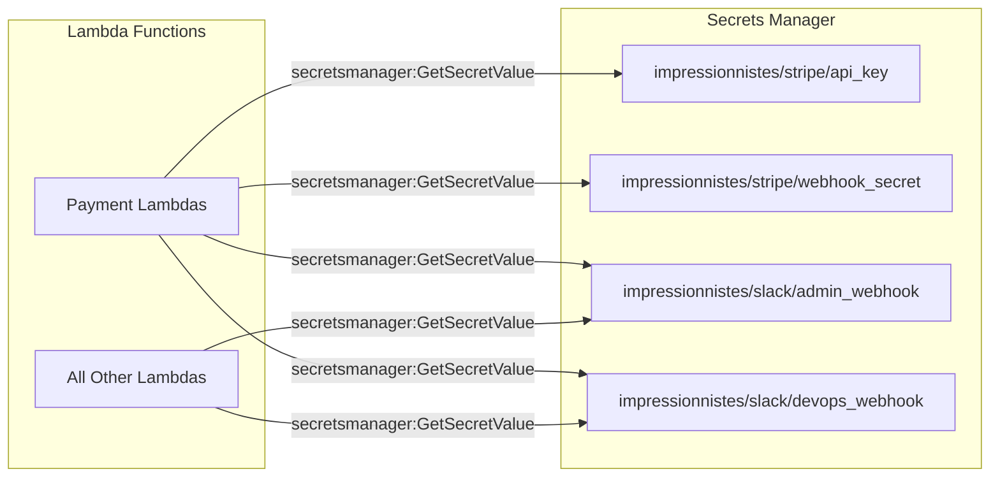
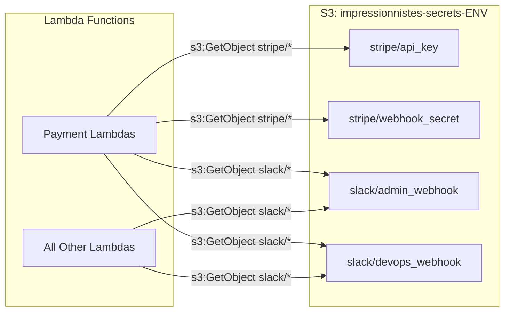
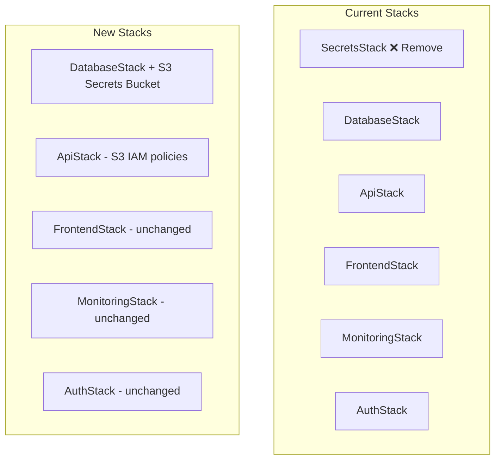

# Design Document: Dev Environment Same-Account Migration

## Overview

This design migrates the dev environment into the same AWS account as production (`206478392268`) by replacing AWS Secrets Manager with S3-based secrets storage, updating IAM policies, and removing the SecretsStack. The migration solves three problems:

1. **Naming conflicts** — Secrets Manager secret names are global within an account, so `impressionnistes/stripe/api_key` can't exist for both dev and prod. S3 buckets are globally unique by name, so `impressionnistes-secrets-dev` and `impressionnistes-secrets-prod` coexist cleanly.
2. **Cost** — Secrets Manager charges $0.40/secret/month. S3 storage is effectively free for 4 small JSON objects.
3. **Certificate provisioning** — The dev ACM certificate currently lives in the old dev account (`458847123929`). A new certificate must be created in the prod account for CloudFront.

The migration preserves the existing public API of the secrets module (`get_stripe_api_key`, `get_stripe_webhook_secret`, `get_slack_admin_webhook`, `get_slack_devops_webhook`, `clear_cache`) so that no Lambda handler code needs to change.

## Architecture

### Current Architecture



### Target Architecture



### CDK Stack Changes



**Design decision**: The S3 secrets bucket will be added to `DatabaseStack` rather than creating a new stack. Rationale:
- DatabaseStack already manages data storage resources (DynamoDB)
- Adding a single S3 bucket doesn't warrant a new stack (avoids CloudFormation stack proliferation)
- The bucket has no cross-stack dependencies that would complicate deployment ordering
- DatabaseStack is deployed early in the pipeline, which is correct for a resource that ApiStack depends on

## Components and Interfaces

### 1. DatabaseStack — S3 Secrets Bucket

A new S3 bucket is added to `DatabaseStack` and exposed as `self.secrets_bucket` for cross-stack reference.

```python
# infrastructure/stacks/database_stack.py (additions)

self.secrets_bucket = s3.Bucket(
    self,
    "SecretsBucket",
    bucket_name=f"impressionnistes-secrets-{env_name}",
    block_public_access=s3.BlockPublicAccess.BLOCK_ALL,
    encryption=s3.BucketEncryption.S3_MANAGED,  # SSE-S3 (AES-256)
    versioning=True,
    removal_policy=RemovalPolicy.DESTROY if env_name == "dev" else RemovalPolicy.RETAIN,
    auto_delete_objects=True if env_name == "dev" else False,
)
```

**Exposed property**: `database_stack.secrets_bucket` (used by ApiStack for IAM grants)

### 2. ApiStack — IAM Policy Changes

The `_create_lambda_function` method is updated to:
1. Add `SECRETS_BUCKET` environment variable to all Lambdas
2. Grant `s3:GetObject` on `slack/*` prefix to all Lambdas
3. Remove the `secretsmanager:GetSecretValue` grant for Slack secrets

The `_create_payment_functions` method is updated to:
1. Grant `s3:GetObject` on `stripe/*` prefix to payment Lambdas
2. Remove the `secretsmanager:GetSecretValue` grant for Stripe secrets

```python
# In _create_lambda_function — replace Secrets Manager grant with S3 grant
self.common_env = {
    'TABLE_NAME': database_stack.table.table_name,
    'USER_POOL_ID': auth_stack.user_pool.user_pool_id,
    'USER_POOL_CLIENT_ID': auth_stack.user_pool_client.user_pool_client_id,
    'ENVIRONMENT': self.env_name,
    'SECRETS_BUCKET': database_stack.secrets_bucket.bucket_name,  # NEW
}

# Replace secretsmanager policy with S3 slack/* read
function.add_to_role_policy(
    iam.PolicyStatement(
        actions=['s3:GetObject'],
        resources=[
            f'{database_stack.secrets_bucket.bucket_arn}/slack/*'
        ]
    )
)

# In _create_payment_functions — add S3 stripe/* read
payment_function.add_to_role_policy(
    iam.PolicyStatement(
        actions=['s3:GetObject'],
        resources=[
            f'{database_stack.secrets_bucket.bucket_arn}/stripe/*'
        ]
    )
)
```

### 3. Secrets Module — S3 Client

`functions/shared/secrets_manager.py` is rewritten to use `boto3.client('s3')` while preserving the exact same public API.

```python
# Public API (unchanged):
def get_secret(object_key: str, field: str) -> str: ...
def get_stripe_api_key() -> str: ...
def get_stripe_webhook_secret() -> str: ...
def get_slack_admin_webhook() -> str: ...
def get_slack_devops_webhook() -> str: ...
def clear_cache(): ...
```

**Internal changes**:
- `secrets_client` becomes `s3_client = boto3.client('s3')`
- `get_secret()` calls `s3_client.get_object(Bucket=bucket, Key=object_key)` instead of `secrets_client.get_secret_value(SecretId=...)`
- Bucket name read from `os.environ['SECRETS_BUCKET']`
- Caching behavior preserved identically
- Error handling preserved (log + raise)

### 4. CDK App Entry Point

`infrastructure/app.py` changes:
- Remove `from stacks.secrets_stack import SecretsStack`
- Remove `secrets_stack = SecretsStack(...)` instantiation
- Remove `secrets_stack` from the tags loop
- Pass `database_stack` to `ApiStack` (already done)

### 5. Config Module — Certificate ARN

`infrastructure/config.py` changes:
- Update `DEV_CONFIG["certificate_arn"]` to the new certificate ARN in account `206478392268`
- The new certificate is created manually via AWS CLI (not CDK) because it must be in `us-east-1` while the CDK app deploys to `eu-west-3`

```bash
# One-time manual command (documented in Makefile help)
aws acm request-certificate \
    --domain-name impressionnistes-dev.aviron-rcpm.fr \
    --validation-method DNS \
    --region us-east-1 \
    --profile rcpm-dev
```

### 6. Makefile — S3-Based Secrets Management

All secrets management targets are rewritten to use `aws s3` / `aws s3api` commands instead of `aws secretsmanager`.

| Current Target | New Behavior |
|---|---|
| `secrets-sync` | Read `secrets.{env}.json`, upload each secret as individual S3 JSON objects |
| `secrets-list` | `aws s3 ls s3://impressionnistes-secrets-{env}/` |
| `secrets-show` | `aws s3 cp` each object and display JSON content |
| `secrets-delete-all` | `aws s3 rm s3://impressionnistes-secrets-{env}/ --recursive` |
| `deploy-secrets` | **Removed** (no more SecretsStack) |
| `destroy-secrets` | **Removed** (no more SecretsStack) |
| `deploy-backend` | Remove `ImpressionnistesSecrets-{env}` from stack list |

### 7. S3 Secret Object Format

Each secret is stored as a separate S3 object with a JSON body:

| S3 Key | JSON Body | Field Used by Module |
|---|---|---|
| `stripe/api_key` | `{"api_key": "sk_..."}` | `api_key` |
| `stripe/webhook_secret` | `{"webhook_secret": "whsec_..."}` | `webhook_secret` |
| `slack/admin_webhook` | `{"webhook_url": "https://hooks.slack.com/..."}` | `webhook_url` |
| `slack/devops_webhook` | `{"webhook_url": "https://hooks.slack.com/..."}` | `webhook_url` |

This format mirrors the existing Secrets Manager JSON structure exactly, so the module's JSON parsing logic stays the same.

## Data Models

### S3 Object Schema

Each secret object follows this schema:

```json
{
  "<field_name>": "<secret_value>"
}
```

Where `<field_name>` matches the field the secrets module extracts:
- `api_key` for `stripe/api_key`
- `webhook_secret` for `stripe/webhook_secret`
- `webhook_url` for `slack/admin_webhook` and `slack/devops_webhook`

### Local Secrets File Schema

The existing `secrets.{env}.json` format is unchanged:

```json
{
  "stripe_secret_key": "sk_test_...",
  "stripe_webhook_secret": "whsec_...",
  "slack_webhook_admin": "https://hooks.slack.com/...",
  "slack_webhook_devops": "https://hooks.slack.com/..."
}
```

The Makefile `secrets-sync` target reads this file and uploads each value as the appropriate S3 object.

### Environment Variables

| Variable | Scope | Value |
|---|---|---|
| `SECRETS_BUCKET` | All Lambda functions | `impressionnistes-secrets-{env}` |

This replaces the implicit Secrets Manager secret name convention. The bucket name is injected by CDK at deploy time.

### Config Changes

| Config Key | Current Value | New Value |
|---|---|---|
| `DEV_CONFIG.certificate_arn` | `arn:aws:acm:us-east-1:458847123929:certificate/79f8324b-...` | `arn:aws:acm:us-east-1:206478392268:certificate/<new-cert-id>` |
| `PROD_CONFIG.certificate_arn` | *(unchanged)* | *(unchanged)* |


## Correctness Properties

*A property is a characteristic or behavior that should hold true across all valid executions of a system — essentially, a formal statement about what the system should do. Properties serve as the bridge between human-readable specifications and machine-verifiable correctness guarantees.*

### PBT Applicability Assessment

Most of this feature is infrastructure-as-code (CDK stack changes, IAM policies, Makefile rewrites) which is not suitable for property-based testing. However, the **secrets module** (`functions/shared/secrets_manager.py`) contains pure function logic for reading, parsing, and caching secrets that is well-suited to PBT. Specifically, the round-trip property (store → retrieve → parse → extract = original value) is a classic serialization property.

### Prework Reflection

From the prework analysis, two criteria were identified as PROPERTY-testable:
- **7.1**: Each secret stored as a separate S3 object with JSON body
- **7.6**: Round-trip property — read, parse, extract field returns original value

These are logically the same property: 7.6 is the universal quantification of 7.1. They are consolidated into a single property below.

Criteria 3.3–3.6 (specific getter functions) are examples of this round-trip property applied to the four known secrets. They are covered by example-based unit tests, not PBT.

### Property 1: Secret value round-trip

*For any* valid secret value (non-empty string), storing it as a JSON object `{"<field>": "<value>"}` in S3 and then retrieving it through the secrets module's `get_secret(object_key, field)` function SHALL return the original secret value.

**Validates: Requirements 7.6, 7.1, 3.3, 3.4, 3.5, 3.6**

## Error Handling

### Secrets Module Errors

| Error Scenario | Behavior | Requirement |
|---|---|---|
| S3 `GetObject` returns `NoSuchKey` | Log error, raise exception | 3.8 |
| S3 `GetObject` returns `AccessDenied` | Log error, raise exception | 3.8 |
| S3 `GetObject` returns network error | Log error, raise exception | 3.8 |
| JSON parsing fails (malformed body) | Log error, raise exception | 3.8 |
| Expected field missing from JSON | Return empty string (for Slack) or raise (for Stripe) | 3.5, 3.6 vs 3.3, 3.4 |
| `SECRETS_BUCKET` env var not set | Raise `KeyError` at module initialization | 3.2 |

**Design decision**: Slack webhook getters return empty string on failure (matching current behavior — the app works without Slack notifications). Stripe getters raise on failure (payment processing cannot proceed without valid keys).

### CDK Deployment Errors

| Error Scenario | Behavior |
|---|---|
| S3 bucket name already taken | CDK deploy fails with `BucketAlreadyExists`. Bucket names are globally unique — the naming convention `impressionnistes-secrets-{env}` should be unique enough. |
| Certificate ARN invalid or in wrong region | CloudFront distribution creation fails. Certificate must be in `us-east-1`. |
| Cross-stack reference failure | If DatabaseStack hasn't been deployed, ApiStack deploy fails. This is the existing deployment order. |

### Makefile Errors

| Error Scenario | Behavior |
|---|---|
| `secrets.{env}.json` not found | `secrets-sync` prints error and exits |
| S3 bucket doesn't exist | AWS CLI commands fail with clear error |
| Invalid JSON in secrets file | Python JSON parser fails with line/column info |

## Testing Strategy

### Dual Testing Approach

This feature uses both unit tests and property-based tests:

- **Unit tests**: Verify specific examples, CDK configuration, error handling, and the four known secret getter functions
- **Property tests**: Verify the universal round-trip property across random secret values

### Property-Based Testing

**Library**: [Hypothesis](https://hypothesis.readthedocs.io/) for Python

> **Note**: The workspace rule `python-testing-guidelines.md` says "DO NOT use the Hypothesis library." However, the requirements document explicitly includes a round-trip property (Requirement 7.6) that is best validated with PBT. If the team prefers to skip PBT, the round-trip property can be covered by example-based tests with representative edge cases (empty-ish strings, unicode, special JSON characters, very long strings). The design includes both approaches.

**Configuration**:
- Minimum 100 iterations per property test
- Tag format: `Feature: dev-env-same-account-migration, Property 1: Secret value round-trip`

**Property test implementation** (using Hypothesis):
```python
from hypothesis import given, strategies as st, settings

@settings(max_examples=100)
@given(secret_value=st.text(min_size=1))
def test_secret_round_trip(secret_value, mock_s3):
    """Feature: dev-env-same-account-migration, Property 1: Secret value round-trip"""
    # Store as JSON
    field_name = "test_field"
    json_body = json.dumps({field_name: secret_value})
    mock_s3.put_object(Bucket=BUCKET, Key="test/secret", Body=json_body)
    
    # Retrieve through secrets module
    result = get_secret("test/secret", field_name)
    
    assert result == secret_value
```

**Alternative without Hypothesis** (example-based):
```python
@pytest.mark.parametrize("secret_value", [
    "sk_test_abc123",
    "whsec_xyz789",
    "https://hooks.slack.com/services/T00/B00/xxx",
    "",  # edge: empty value
    "value with spaces and spécial chars: é à ü ñ 中文",
    "value with JSON chars: {\"key\": \"val\"}",
    "a" * 10000,  # edge: very long value
    'value with "quotes" and \\backslashes',
])
def test_secret_round_trip(secret_value, mock_s3):
    field_name = "test_field"
    json_body = json.dumps({field_name: secret_value})
    mock_s3.put_object(Bucket=BUCKET, Key="test/secret", Body=json_body)
    
    result = get_secret("test/secret", field_name)
    assert result == secret_value
```

### Unit Tests

| Test | Type | Validates |
|---|---|---|
| `test_get_stripe_api_key` | Example | 3.3 |
| `test_get_stripe_webhook_secret` | Example | 3.4 |
| `test_get_slack_admin_webhook` | Example | 3.5 |
| `test_get_slack_devops_webhook` | Example | 3.6 |
| `test_caching_prevents_duplicate_s3_calls` | Example | 3.7 |
| `test_clear_cache_resets_state` | Example | 3.7 |
| `test_s3_error_raises_exception` | Edge case | 3.8 |
| `test_slack_webhook_returns_empty_on_error` | Edge case | 3.5, 3.6 |
| `test_public_api_unchanged` | Example | 3.9 |
| `test_reads_bucket_from_env_var` | Example | 3.2 |
| `test_uses_s3_client` | Example | 3.1 |

### CDK Assertion Tests (Optional)

If CDK assertion tests are added:

| Test | Validates |
|---|---|
| `test_secrets_bucket_created_with_correct_name` | 1.1 |
| `test_secrets_bucket_blocks_public_access` | 1.2 |
| `test_secrets_bucket_has_sse_s3_encryption` | 1.3 |
| `test_secrets_bucket_versioning_enabled` | 1.4 |
| `test_dev_bucket_has_destroy_policy` | 1.5 |
| `test_prod_bucket_has_retain_policy` | 1.6 |
| `test_payment_lambdas_have_stripe_s3_access` | 2.1 |
| `test_all_lambdas_have_slack_s3_access` | 2.2 |
| `test_no_secrets_manager_permissions` | 2.3 |
| `test_all_lambdas_have_secrets_bucket_env_var` | 2.4 |

### Manual Verification

| Check | Validates |
|---|---|
| `make secrets-sync ENV=dev` uploads to S3 | 6.1 |
| `make secrets-list` shows S3 objects | 6.2 |
| `make secrets-show` displays secret values from S3 | 6.3 |
| `make deploy-backend` excludes SecretsStack | 6.6 |
| `make help` shows updated S3-based commands | 6.8 |
| ACM certificate created and validated in `us-east-1` | 5.1 |
| CloudFront serves dev site with new certificate | 5.3 |

### Test Execution

```bash
# Run all backend tests (includes secrets module tests)
cd infrastructure && make test

# Run only secrets module tests
source tests/venv/bin/activate
pytest tests/unit/test_secrets_manager.py -v
```
