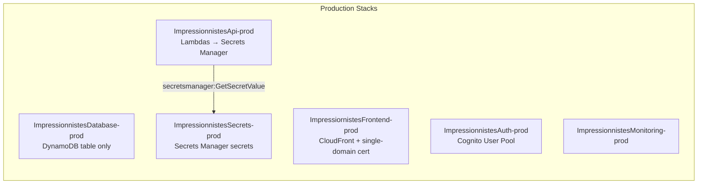
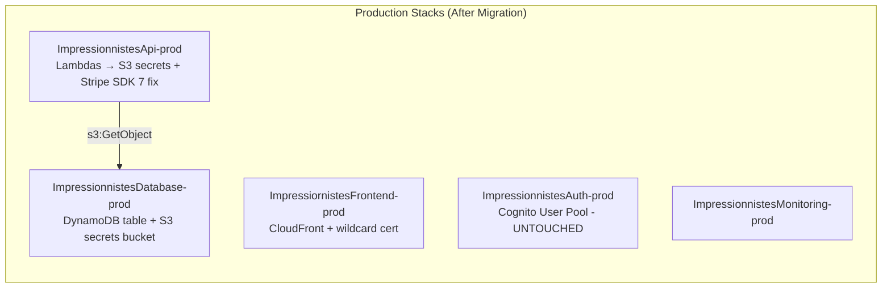
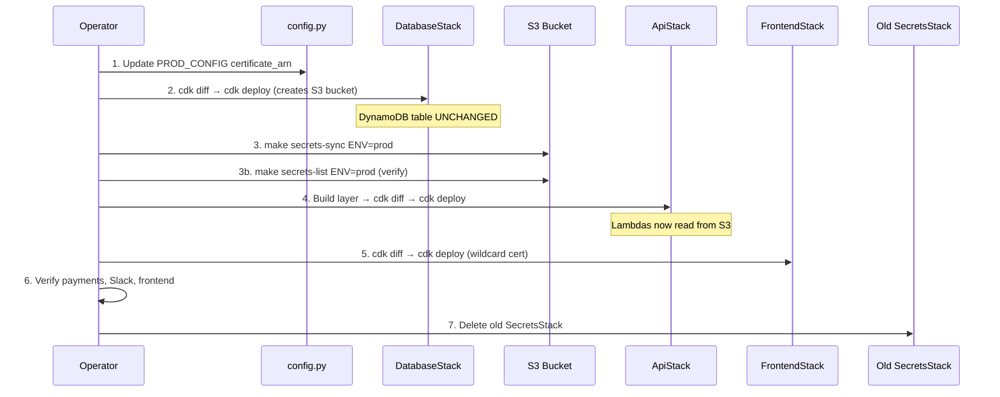

# Design Document: Production S3 Secrets Alignment

## Overview

This design covers the safe, incremental deployment of the S3-based secrets migration to the production environment. All code changes are already complete (implemented in the `dev-env-same-account-migration` spec). This spec is purely operational — it defines the exact deployment procedure, safety checks, rollback plan, and verification steps.

The deployment migrates production Lambda functions from AWS Secrets Manager to S3-based secrets storage, updates the CloudFront certificate to the shared wildcard cert, and cleans up the old SecretsStack — all without touching the DynamoDB table or Cognito User Pool.

### Key Constraints

- **Zero downtime** — Secrets must be in S3 before Lambdas are updated
- **Data preservation** — DynamoDB table and Cognito User Pool must remain untouched
- **Individual stack deploys** — No `make deploy-backend` or `cdk deploy --all`
- **Diff before deploy** — Every `cdk deploy` must be preceded by `cdk diff` review
- **AWS Profile** — All commands use `rcpm-prod`

## Architecture

### Current Production State



### Target Production State



### Deployment Sequence



## Components and Interfaces

### 1. Config Module Change

The single code change required:

```python
# infrastructure/config.py — PROD_CONFIG
# BEFORE:
"certificate_arn": "arn:aws:acm:us-east-1:206478392268:certificate/dbdc7ccc-f905-45b0-94e3-906fcbb2aabe"

# AFTER:
"certificate_arn": "arn:aws:acm:us-east-1:206478392268:certificate/38b35b2f-317e-48e6-9e1a-08a625f9fd62"
```

This switches CloudFront from the single-domain cert (`impressionnistes.aviron-rcpm.fr`) to the wildcard cert (`*.aviron-rcpm.fr`).

### 2. DatabaseStack Deployment

Deploying `ImpressionnistesDatabase-prod` will:
- **ADD**: S3 bucket `rcpm-impressionnistes-secrets-prod` (new resource)
- **UNCHANGED**: DynamoDB table `impressionnistes-registration-prod` (RETAIN policy, no schema changes)
- **UNCHANGED**: Init config Lambda and custom resource

The S3 bucket configuration (already in code):
- `bucket_name`: `rcpm-impressionnistes-secrets-prod`
- `block_public_access`: BLOCK_ALL
- `encryption`: S3_MANAGED (SSE-S3)
- `versioned`: True
- `removal_policy`: RETAIN (prod)
- `auto_delete_objects`: False (prod)

### 3. Secrets Upload

The `make secrets-sync ENV=prod` command reads `secrets.prod.json` and uploads four S3 objects:

| S3 Key | JSON Body | Source Field in secrets.prod.json |
|--------|-----------|-----------------------------------|
| `stripe/api_key` | `{"api_key": "sk_live_..."}` | `stripe_secret_key` |
| `stripe/webhook_secret` | `{"webhook_secret": "whsec_..."}` | `stripe_webhook_secret` |
| `slack/admin_webhook` | `{"webhook_url": "https://hooks.slack.com/..."}` | `slack_webhook_admin` |
| `slack/devops_webhook` | `{"webhook_url": "https://hooks.slack.com/..."}` | `slack_webhook_devops` |

### 4. ApiStack Deployment

Deploying `ImpressionnistesApi-prod` will:
- **UPDATE**: All Lambda functions get `SECRETS_BUCKET` env var → `rcpm-impressionnistes-secrets-prod`
- **UPDATE**: Lambda layer rebuilt with S3-based `secrets_manager.py`
- **UPDATE**: IAM policies — add `s3:GetObject` on `slack/*` (all Lambdas) and `stripe/*` (payment Lambdas)
- **UPDATE**: `confirm_payment_webhook` Lambda includes Stripe SDK 7+ fix (JSON body parsing)
- **REMOVE**: Secrets Manager IAM permissions (no longer needed)

### 5. FrontendStack Deployment

Deploying `ImpressiornistesFrontend-prod` will:
- **UPDATE**: CloudFront distribution certificate from single-domain to wildcard
- **UNCHANGED**: S3 bucket, OAI, custom domain name (`impressionnistes.aviron-rcpm.fr`)
- **NOTE**: CloudFront distribution update takes 5-15 minutes to propagate

### 6. Old SecretsStack Destruction

After verification, destroy `ImpressionnistesSecrets-prod`:
- Uses `aws cloudformation delete-stack` (not CDK, since the stack is no longer in `app.py`)
- Secrets Manager secrets may be retained if they have RETAIN policy — this is acceptable as a temporary fallback

## Data Models

No data model changes. The DynamoDB table schema, GSIs, and all existing data remain untouched.

The only "data" involved is the secrets uploaded to S3, which follow the same JSON format already validated in dev:

```json
// stripe/api_key
{"api_key": "sk_live_..."}

// stripe/webhook_secret
{"webhook_secret": "whsec_..."}

// slack/admin_webhook
{"webhook_url": "https://hooks.slack.com/services/..."}

// slack/devops_webhook
{"webhook_url": "https://hooks.slack.com/services/..."}
```

## Error Handling

### Deployment Failures

| Failure Point | Impact | Recovery |
|---------------|--------|----------|
| DatabaseStack deploy fails | No S3 bucket created | Fix issue, retry. DynamoDB unaffected (RETAIN). |
| Secrets upload fails | S3 bucket exists but empty | Retry `make secrets-sync ENV=prod`. No downstream impact yet. |
| ApiStack deploy fails mid-way | Some Lambdas updated, some not | CloudFormation rolls back automatically. Lambdas revert to previous version (still using Secrets Manager). |
| ApiStack deploy succeeds but secrets missing | Lambdas fail to read secrets | Secrets Manager still exists as fallback. Upload secrets immediately, or rollback ApiStack. |
| FrontendStack deploy fails | Certificate not updated | CloudFront continues with old cert. Retry deploy. |
| Old SecretsStack deletion fails | Orphaned stack | Investigate dependencies. Safe to leave temporarily. |

### Rollback Plan

**If ApiStack deployment causes issues after success:**

1. Secrets Manager secrets still exist (old SecretsStack not yet destroyed)
2. Rollback ApiStack to previous version:
   ```bash
   # Revert config.py and secrets_manager.py to use Secrets Manager
   # Rebuild layer and redeploy
   cd functions && ./build-layer.sh
   cd infrastructure && cdk deploy ImpressionnistesApi-prod -c env=prod --profile rcpm-prod
   ```
3. Alternatively, use CloudFormation console to roll back to previous successful deployment

**If FrontendStack certificate causes issues:**
1. Revert `config.py` PROD_CONFIG certificate_arn to old value
2. Redeploy FrontendStack

**Critical safety net**: The old SecretsStack is destroyed LAST, only after full verification. Until then, Secrets Manager secrets remain available as a fallback.

### CDK Diff Safety Checks

Before each deploy, the operator MUST review `cdk diff` output for:

| Red Flag | Action |
|----------|--------|
| DynamoDB table replacement or modification | **ABORT** — investigate immediately |
| Cognito User Pool changes | **ABORT** — should not appear in these deploys |
| Unexpected resource deletions | **ABORT** — review carefully |
| S3 bucket creation (DatabaseStack) | **EXPECTED** — proceed |
| Lambda function updates (ApiStack) | **EXPECTED** — proceed |
| CloudFront distribution update (FrontendStack) | **EXPECTED** — proceed |
| IAM policy changes (ApiStack) | **EXPECTED** — verify they add S3 and remove Secrets Manager |

## Testing Strategy

### PBT Applicability Assessment

Property-based testing is **NOT applicable** for this feature. This spec is purely operational — it involves:
- Updating a single configuration string (certificate ARN)
- Running CDK deployments
- Uploading secrets via AWS CLI
- Manual verification of live services

There is no new code logic, no pure functions, no data transformations, and no algorithms to test. The code was already tested in the `dev-env-same-account-migration` spec.

### Verification Strategy

This feature uses **manual operational verification** rather than automated tests:

#### Pre-Deployment Checks

| Check | Command | Expected Result |
|-------|---------|-----------------|
| Wildcard cert exists and is valid | `aws acm describe-certificate --certificate-arn arn:aws:acm:us-east-1:206478392268:certificate/38b35b2f-317e-48e6-9e1a-08a625f9fd62 --region us-east-1 --profile rcpm-prod` | Status: ISSUED |
| `secrets.prod.json` exists | `ls secrets.prod.json` | File exists with valid JSON |
| Lambda layer builds successfully | `cd functions && ./build-layer.sh` | Exit code 0 |
| CDK synth succeeds | `cd infrastructure && cdk synth -c env=prod` | No errors |

#### Post-Deployment Verification

| Check | Method | Success Criteria |
|-------|--------|------------------|
| S3 secrets accessible | `make secrets-list ENV=prod` | 4 objects listed |
| Stripe payments work | Check CloudWatch logs for `confirm_payment_webhook` | No S3 errors, successful webhook processing |
| Slack notifications work | Trigger a test event or check recent logs | Slack messages delivered |
| Frontend accessible | Visit `https://impressionnistes.aviron-rcpm.fr` | Page loads with valid HTTPS |
| Certificate valid | Browser padlock or `curl -vI https://impressionnistes.aviron-rcpm.fr` | Wildcard cert served |
| Lambda secrets retrieval | Check CloudWatch logs for any Lambda | "Successfully retrieved secret" log entries |

#### Smoke Test Commands

```bash
# Verify S3 bucket exists and has secrets
aws s3 ls s3://rcpm-impressionnistes-secrets-prod/ --profile rcpm-prod

# Verify Lambda can read secrets (check recent invocation logs)
aws logs filter-log-events \
  --log-group-name /aws/lambda/ImpressionnistesApi-prod-* \
  --filter-pattern "Successfully retrieved secret" \
  --start-time $(date -v-5M +%s000) \
  --profile rcpm-prod

# Verify CloudFront certificate
curl -sI https://impressionnistes.aviron-rcpm.fr | grep -i "server\|x-cache"

# Verify old SecretsStack still exists (before cleanup)
aws cloudformation describe-stacks --stack-name ImpressionnistesSecrets-prod --profile rcpm-prod --query 'Stacks[0].StackStatus'
```

### What Was Already Tested

The following was validated during the dev migration (spec: `dev-env-same-account-migration`):
- S3 secrets module round-trip (property-based test)
- All four getter functions (unit tests)
- Caching behavior (unit tests)
- Error handling (unit tests)
- CDK stack assertions (S3 bucket config, IAM policies)
- End-to-end dev deployment verification

No additional automated tests are needed for the prod deployment — the code is identical.
