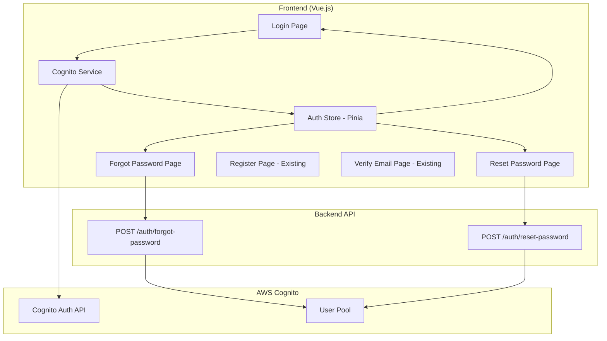

# Design Document: Self-Hosted Authentication

## Overview

This design document describes the implementation of self-hosted authentication pages to replace the current Cognito Hosted UI. The solution provides a seamless, branded authentication experience while maintaining security through AWS Cognito integration.

The implementation focuses on three main areas:
1. **Self-hosted login page** - Direct Cognito authentication without Hosted UI redirect
2. **Forgot password flow** - New functionality to request and complete password resets
3. **Integration** - Seamless integration with existing registration and verification flows

The design leverages AWS Amplify for Cognito SDK integration, maintains the existing Vue.js architecture, and follows the established design system patterns.

## Architecture

### High-Level Architecture



### Authentication Flow

**Login Flow:**
1. User enters email and password
2. Frontend calls Cognito SDK directly (no Hosted UI redirect)
3. Cognito validates credentials and returns tokens
4. Frontend stores tokens in session/local storage
5. User redirected to dashboard

**Forgot Password Flow:**
1. User enters email on forgot password page
2. Frontend calls `/auth/forgot-password` endpoint
3. Backend triggers Cognito to send verification code via email
4. User redirected to reset password page
5. User enters email, code, and new password
6. Frontend calls `/auth/reset-password` endpoint
7. Backend validates code and updates password in Cognito
8. User redirected to login page

### Technology Stack

- **Frontend Framework:** Vue.js 3 with Composition API
- **State Management:** Pinia (existing authStore)
- **AWS Integration:** AWS Amplify (recommended) or AWS SDK for JavaScript
- **Routing:** Vue Router
- **UI Components:** Existing design system components (BaseButton, FormGroup, MessageAlert)
- **Validation:** Frontend validation + Cognito backend validation

## Components and Interfaces

### Frontend Components

#### 1. LoginForm.vue (Modified)

**Purpose:** Self-hosted login form replacing Cognito Hosted UI redirect

**Props:** None

**Data:**
```javascript
{
  email: string,
  password: string,
  rememberMe: boolean,
  loading: boolean,
  errorMessage: string,
  sessionTimeoutMessage: string  // Message explaining why session expired
}
```

**Methods:**
- `handleLogin()` - Authenticate user via Cognito SDK
- `validateForm()` - Validate email and password format
- `handleError(error)` - Map Cognito errors to user-friendly messages
- `checkSessionTimeout()` - Check if redirected due to session timeout and display appropriate message

**Template Structure:**
```vue
<form @submit.prevent="handleLogin">
  <!-- Session timeout message (if redirected from expired session) -->
  <MessageAlert 
    v-if="sessionTimeoutMessage" 
    type="warning" 
    :message="sessionTimeoutMessage"
    :dismissible="true"
    @dismiss="sessionTimeoutMessage = ''"
  />
  
  <FormGroup label="Email" :error="errors.email">
    <input v-model="email" type="email" required />
  </FormGroup>
  
  <FormGroup label="Mot de passe" :error="errors.password">
    <input v-model="password" type="password" required />
  </FormGroup>
  
  <div class="remember-me">
    <input v-model="rememberMe" type="checkbox" id="remember" />
    <label for="remember">Se souvenir de moi</label>
  </div>
  
  <MessageAlert v-if="errorMessage" type="error" :message="errorMessage" />
  
  <BaseButton type="submit" variant="primary" :loading="loading" full-width>
    Se connecter
  </BaseButton>
  
  <div class="auth-links">
    <router-link to="/forgot-password">Mot de passe oublié ?</router-link>
    <router-link to="/register">Créer un compte</router-link>
    <router-link to="/verify-email">Vérifier mon email</router-link>
  </div>
</form>
```

**Session Timeout Message Logic:**
```javascript
// In component mounted/created hook
checkSessionTimeout() {
  const authStore = useAuthStore()
  
  if (authStore.sessionTimeoutReason === 'inactivity') {
    this.sessionTimeoutMessage = 'Votre session a expiré après 30 minutes d\'inactivité. Veuillez vous reconnecter.'
  } else if (authStore.sessionTimeoutReason === 'max_duration') {
    this.sessionTimeoutMessage = 'Votre session a expiré après 5 heures d\'activité. Veuillez vous reconnecter.'
  }
  
  // Clear the timeout reason after displaying
  authStore.sessionTimeoutReason = null
}
```

#### 2. ForgotPasswordForm.vue (New)

**Purpose:** Request password reset verification code

**Props:** None

**Data:**
```javascript
{
  email: string,
  loading: boolean,
  errorMessage: string,
  successMessage: string
}
```

**Methods:**
- `handleSubmit()` - Call `/auth/forgot-password` endpoint
- `validateEmail()` - Validate email format
- `redirectToReset()` - Redirect to reset password page with email

**Template Structure:**
```vue
<form @submit.prevent="handleSubmit">
  <p class="instructions">
    Entrez votre adresse email pour recevoir un code de vérification.
  </p>
  
  <FormGroup label="Email" :error="errors.email">
    <input v-model="email" type="email" required />
  </FormGroup>
  
  <MessageAlert v-if="errorMessage" type="error" :message="errorMessage" />
  <MessageAlert v-if="successMessage" type="success" :message="successMessage" />
  
  <BaseButton type="submit" variant="primary" :loading="loading" full-width>
    Envoyer le code
  </BaseButton>
  
  <div class="auth-links">
    <router-link to="/login">Retour à la connexion</router-link>
  </div>
</form>
```

#### 3. ResetPasswordForm.vue (New)

**Purpose:** Complete password reset with verification code

**Props:** None

**Data:**
```javascript
{
  email: string,
  verificationCode: string,
  newPassword: string,
  confirmPassword: string,
  loading: boolean,
  errorMessage: string,
  successMessage: string,
  passwordStrength: {
    score: number,
    feedback: string[]
  }
}
```

**Methods:**
- `handleSubmit()` - Call `/auth/reset-password` endpoint
- `validateForm()` - Validate all fields
- `checkPasswordStrength()` - Calculate password strength in real-time
- `validatePasswordMatch()` - Ensure passwords match

**Template Structure:**
```vue
<form @submit.prevent="handleSubmit">
  <FormGroup label="Email" :error="errors.email">
    <input v-model="email" type="email" required />
  </FormGroup>
  
  <FormGroup label="Code de vérification" :error="errors.code">
    <input v-model="verificationCode" type="text" required />
  </FormGroup>
  
  <FormGroup label="Nouveau mot de passe" :error="errors.password">
    <input v-model="newPassword" type="password" required @input="checkPasswordStrength" />
    <PasswordStrengthIndicator :strength="passwordStrength" />
  </FormGroup>
  
  <FormGroup label="Confirmer le mot de passe" :error="errors.confirmPassword">
    <input v-model="confirmPassword" type="password" required />
  </FormGroup>
  
  <MessageAlert v-if="errorMessage" type="error" :message="errorMessage" />
  <MessageAlert v-if="successMessage" type="success" :message="successMessage" />
  
  <BaseButton type="submit" variant="primary" :loading="loading" full-width>
    Réinitialiser le mot de passe
  </BaseButton>
  
  <div class="auth-links">
    <router-link to="/login">Retour à la connexion</router-link>
  </div>
</form>
```

#### 4. PasswordStrengthIndicator.vue (New)

**Purpose:** Display real-time password strength feedback

**Props:**
```javascript
{
  strength: {
    score: number,      // 0-4
    feedback: string[]  // Array of feedback messages
  }
}
```

**Template Structure:**
```vue
<div class="password-strength">
  <div class="strength-bar">
    <div class="strength-fill" :class="strengthClass" :style="{ width: strengthWidth }"></div>
  </div>
  <div class="strength-label" :class="strengthClass">
    {{ strengthLabel }}
  </div>
  <ul v-if="strength.feedback.length" class="strength-feedback">
    <li v-for="(item, index) in strength.feedback" :key="index">{{ item }}</li>
  </ul>
</div>
```

### Services and Utilities

#### 1. cognitoService.js (New)

**Purpose:** Centralized service for Cognito SDK operations

**Methods:**

```javascript
/**
 * Initialize Cognito configuration
 */
function initializeCognito(config) {
  // Configure Amplify with User Pool ID and Client ID
}

/**
 * Sign in user with email and password
 * @param {string} email - User email
 * @param {string} password - User password
 * @returns {Promise<CognitoUser>} - Authenticated user with tokens
 */
async function signIn(email, password) {
  // Call Cognito initiateAuth or signIn
  // Return user object with tokens
}

/**
 * Sign out current user
 * @returns {Promise<void>}
 */
async function signOut() {
  // Clear Cognito session
  // Clear local storage
}

/**
 * Get current authenticated user
 * @returns {Promise<CognitoUser|null>}
 */
async function getCurrentUser() {
  // Check if user is authenticated
  // Return user or null
}

/**
 * Get current session tokens
 * @returns {Promise<Tokens>}
 */
async function getTokens() {
  // Return access token, id token, refresh token
}

/**
 * Refresh authentication tokens
 * @returns {Promise<Tokens>}
 */
async function refreshTokens() {
  // Use refresh token to get new tokens
}
```

#### 2. passwordStrength.js (New)

**Purpose:** Calculate password strength and provide feedback

**Functions:**

```javascript
/**
 * Calculate password strength
 * @param {string} password - Password to evaluate
 * @returns {Object} - { score: 0-4, feedback: string[] }
 */
function calculatePasswordStrength(password) {
  const feedback = []
  let score = 0
  
  // Check length
  if (password.length < 12) {
    feedback.push('Le mot de passe doit contenir au moins 12 caractères')
  } else {
    score++
  }
  
  // Check uppercase
  if (!/[A-Z]/.test(password)) {
    feedback.push('Ajoutez au moins une lettre majuscule')
  } else {
    score++
  }
  
  // Check lowercase
  if (!/[a-z]/.test(password)) {
    feedback.push('Ajoutez au moins une lettre minuscule')
  } else {
    score++
  }
  
  // Check numbers
  if (!/[0-9]/.test(password)) {
    feedback.push('Ajoutez au moins un chiffre')
  } else {
    score++
  }
  
  // Check special characters
  if (!/[!@#$%^&*()_+\-=\[\]{};':"\\|,.<>\/?]/.test(password)) {
    feedback.push('Ajoutez au moins un caractère spécial')
  } else {
    score++
  }
  
  return { score, feedback }
}

/**
 * Validate password meets minimum requirements
 * @param {string} password - Password to validate
 * @returns {boolean}
 */
function isPasswordValid(password) {
  const { score } = calculatePasswordStrength(password)
  return score >= 5 && password.length >= 12
}
```

#### 3. authErrorMapper.js (New)

**Purpose:** Map Cognito error codes to user-friendly messages

**Functions:**

```javascript
/**
 * Map Cognito error to user-friendly message
 * @param {Error} error - Cognito error object
 * @returns {string} - User-friendly error message
 */
function mapAuthError(error) {
  const errorCode = error.code || error.name
  
  const errorMap = {
    'NotAuthorizedException': 'Email ou mot de passe incorrect',
    'UserNotConfirmedException': 'Votre compte n\'est pas vérifié. Veuillez vérifier votre email.',
    'UserNotFoundException': 'Aucun compte trouvé avec cet email',
    'InvalidParameterException': 'Paramètres invalides. Veuillez vérifier vos informations.',
    'TooManyRequestsException': 'Trop de tentatives. Veuillez réessayer plus tard.',
    'LimitExceededException': 'Limite de tentatives atteinte. Veuillez réessayer plus tard.',
    'CodeMismatchException': 'Code de vérification incorrect',
    'ExpiredCodeException': 'Code de vérification expiré. Veuillez demander un nouveau code.',
    'InvalidPasswordException': 'Le mot de passe ne respecte pas les exigences de sécurité',
    'NetworkError': 'Erreur de connexion. Veuillez vérifier votre connexion internet.'
  }
  
  return errorMap[errorCode] || 'Une erreur est survenue. Veuillez réessayer.'
}
```

### Store Updates

#### authStore.js (Modified)

**Purpose:** Manage authentication state using Pinia

**State:**
```javascript
{
  user: null,              // Current user object
  tokens: null,            // Auth tokens
  isAuthenticated: false,  // Authentication status
  loading: false,          // Loading state
  error: null,             // Error message
  sessionTimeoutReason: null // Reason for session timeout ('inactivity' | 'max_duration' | null)
}
```

**Actions:**

```javascript
/**
 * Login user with email and password
 * @param {string} email
 * @param {string} password
 * @param {boolean} rememberMe
 */
async login(email, password, rememberMe) {
  this.loading = true
  this.error = null
  
  try {
    const user = await cognitoService.signIn(email, password)
    const tokens = await cognitoService.getTokens()
    
    this.user = user
    this.tokens = tokens
    this.isAuthenticated = true
    
    // Store tokens based on rememberMe
    const storage = rememberMe ? localStorage : sessionStorage
    storage.setItem('authTokens', JSON.stringify(tokens))
    
    return true
  } catch (error) {
    this.error = mapAuthError(error)
    return false
  } finally {
    this.loading = false
  }
}

/**
 * Logout current user
 */
async logout() {
  await cognitoService.signOut()
  
  this.user = null
  this.tokens = null
  this.isAuthenticated = false
  
  localStorage.removeItem('authTokens')
  sessionStorage.removeItem('authTokens')
  sessionStorage.removeItem('loginTime')
  sessionStorage.removeItem('lastActivityTime')
  
  // Clear session check interval
  if (this.sessionCheckInterval) {
    clearInterval(this.sessionCheckInterval)
    this.sessionCheckInterval = null
  }
}

/**
 * Initialize auth state from stored tokens
 */
async initializeAuth() {
  const tokens = localStorage.getItem('authTokens') || sessionStorage.getItem('authTokens')
  
  if (tokens) {
    try {
      const user = await cognitoService.getCurrentUser()
      if (user) {
        this.user = user
        this.tokens = JSON.parse(tokens)
        this.isAuthenticated = true
        
        // Initialize activity tracking for session timeout
        this.initializeActivityTracking()
      }
    } catch (error) {
      // Token expired or invalid, clear storage
      this.logout()
    }
  }
}

/**
 * Initialize activity tracking for session timeout
 * - 5 hour maximum session duration
 * - 30 minute inactivity timeout
 */
initializeActivityTracking() {
  const SESSION_MAX_DURATION = 5 * 60 * 60 * 1000 // 5 hours in ms
  const INACTIVITY_TIMEOUT = 30 * 60 * 1000 // 30 minutes in ms
  
  // Store login time
  const loginTime = Date.now()
  sessionStorage.setItem('loginTime', loginTime.toString())
  
  // Store last activity time
  let lastActivityTime = Date.now()
  sessionStorage.setItem('lastActivityTime', lastActivityTime.toString())
  
  // Update last activity on user interaction
  const updateActivity = () => {
    lastActivityTime = Date.now()
    sessionStorage.setItem('lastActivityTime', lastActivityTime.toString())
  }
  
  // Track user activity
  const events = ['mousedown', 'keydown', 'scroll', 'touchstart', 'click']
  events.forEach(event => {
    document.addEventListener(event, updateActivity, { passive: true })
  })
  
  // Check session validity periodically
  const checkSession = setInterval(() => {
    const now = Date.now()
    const storedLoginTime = parseInt(sessionStorage.getItem('loginTime') || '0')
    const storedLastActivity = parseInt(sessionStorage.getItem('lastActivityTime') || '0')
    
    // Check if session exceeded max duration
    if (now - storedLoginTime > SESSION_MAX_DURATION) {
      clearInterval(checkSession)
      this.sessionTimeoutReason = 'max_duration'
      this.logout()
      return
    }
    
    // Check if user has been inactive too long
    if (now - storedLastActivity > INACTIVITY_TIMEOUT) {
      clearInterval(checkSession)
      this.sessionTimeoutReason = 'inactivity'
      this.logout()
      return
    }
  }, 60000) // Check every minute
  
  // Store interval ID for cleanup
  this.sessionCheckInterval = checkSession
}

/**
 * Request password reset code
 * @param {string} email
 */
async forgotPassword(email) {
  this.loading = true
  this.error = null
  
  try {
    const response = await fetch('/auth/forgot-password', {
      method: 'POST',
      headers: { 'Content-Type': 'application/json' },
      body: JSON.stringify({ email })
    })
    
    if (!response.ok) {
      const error = await response.json()
      throw new Error(error.message)
    }
    
    return true
  } catch (error) {
    this.error = error.message || 'Erreur lors de l\'envoi du code'
    return false
  } finally {
    this.loading = false
  }
}

/**
 * Reset password with verification code
 * @param {string} email
 * @param {string} code
 * @param {string} newPassword
 */
async resetPassword(email, code, newPassword) {
  this.loading = true
  this.error = null
  
  try {
    const response = await fetch('/auth/reset-password', {
      method: 'POST',
      headers: { 'Content-Type': 'application/json' },
      body: JSON.stringify({ email, code, new_password: newPassword })
    })
    
    if (!response.ok) {
      const error = await response.json()
      throw new Error(error.message)
    }
    
    return true
  } catch (error) {
    this.error = error.message || 'Erreur lors de la réinitialisation'
    return false
  } finally {
    this.loading = false
  }
}
```

### Router Configuration

**New Routes:**

```javascript
{
  path: '/login',
  name: 'Login',
  component: () => import('@/views/LoginView.vue'),
  meta: { requiresAuth: false }
},
{
  path: '/forgot-password',
  name: 'ForgotPassword',
  component: () => import('@/views/ForgotPasswordView.vue'),
  meta: { requiresAuth: false }
},
{
  path: '/reset-password',
  name: 'ResetPassword',
  component: () => import('@/views/ResetPasswordView.vue'),
  meta: { requiresAuth: false }
}
```

**Navigation Guards:**

```javascript
router.beforeEach(async (to, from, next) => {
  const authStore = useAuthStore()
  
  // Initialize auth state if not already done
  if (!authStore.isAuthenticated) {
    await authStore.initializeAuth()
  }
  
  // Check if route requires authentication
  if (to.meta.requiresAuth && !authStore.isAuthenticated) {
    next({ name: 'Login', query: { redirect: to.fullPath } })
  } else if (to.name === 'Login' && authStore.isAuthenticated) {
    next({ name: 'Dashboard' })
  } else {
    next()
  }
})
```

## Data Models

### CognitoUser

```javascript
{
  username: string,           // User's email
  attributes: {
    email: string,
    email_verified: boolean,
    sub: string,              // Cognito user ID
    'custom:role': string,    // User role (admin, team_manager)
    'custom:team_id': string  // Team ID for team managers
  }
}
```

### AuthTokens

```javascript
{
  accessToken: string,   // JWT access token
  idToken: string,       // JWT ID token
  refreshToken: string   // Refresh token
}
```

### PasswordStrength

```javascript
{
  score: number,        // 0-5 (0=very weak, 5=strong)
  feedback: string[]    // Array of improvement suggestions
}
```

### API Request/Response Models

**POST /auth/forgot-password**

Request:
```json
{
  "email": "user@example.com"
}
```

Response (Success):
```json
{
  "message": "Code de vérification envoyé"
}
```

Response (Error):
```json
{
  "error": "User not found"
}
```

**POST /auth/reset-password**

Request:
```json
{
  "email": "user@example.com",
  "code": "123456",
  "new_password": "NewSecurePassword123!"
}
```

Response (Success):
```json
{
  "message": "Mot de passe réinitialisé avec succès"
}
```

Response (Error):
```json
{
  "error": "Invalid verification code"
}
```


## Correctness Properties

A property is a characteristic or behavior that should hold true across all valid executions of a system—essentially, a formal statement about what the system should do. Properties serve as the bridge between human-readable specifications and machine-verifiable correctness guarantees.

### Property 1: Direct Cognito SDK Authentication

*For any* login attempt, the authentication system should use the Cognito SDK directly (via `initiateAuth` or equivalent) and should never redirect to the Cognito Hosted UI.

**Validates: Requirements 1.2, 1.7, 10.2, 10.3**

### Property 2: Token Storage Based on Remember Me

*For any* successful login, if "Remember Me" is unchecked, tokens should be stored in sessionStorage; if "Remember Me" is checked, tokens should be stored in localStorage.

**Validates: Requirements 1.3, 6.1, 6.2**

### Property 3: Authentication Failure Error Display

*For any* authentication failure (invalid credentials, unverified account, rate limiting, network error), the system should display an appropriate inline error message without crashing.

**Validates: Requirements 1.4, 5.1, 5.6**

### Property 4: Session Persistence Behavior

*For any* login with "Remember Me" checked, the session should persist after browser closure (localStorage); for any login without "Remember Me", the session should not persist after browser closure (sessionStorage).

**Validates: Requirements 1.6**

### Property 5: Forgot Password API Call

*For any* valid email submission on the forgot password page, the system should call the `/auth/forgot-password` endpoint with the correct payload structure.

**Validates: Requirements 2.2**

### Property 6: Forgot Password Success Flow

*For any* successful forgot password request, the system should display a success message and redirect to the reset password page with the email pre-filled.

**Validates: Requirements 2.3, 3.2**

### Property 7: Email Format Validation

*For any* email input on forgot password or reset password forms, the system should validate the email format and prevent submission if invalid.

**Validates: Requirements 2.6**

### Property 8: Reset Password API Call

*For any* valid reset password submission (email, code, new password), the system should call the `/auth/reset-password` endpoint with the correct payload structure.

**Validates: Requirements 3.3**

### Property 9: Reset Password Success Flow

*For any* successful password reset, the system should display a success message and redirect to the login page after exactly 3 seconds.

**Validates: Requirements 3.4**

### Property 10: Password Validation Rules

*For any* password input, the system should enforce all validation rules: minimum 12 characters, at least one uppercase letter, one lowercase letter, one number, and one special character. Passwords not meeting these requirements should be rejected with specific feedback.

**Validates: Requirements 3.6, 3.7, 4.2, 4.3, 4.6**

### Property 11: Password Strength Indicator

*For any* password input, the system should display a real-time strength indicator that updates as the user types, showing the strength score (0-5) and specific feedback on missing requirements.

**Validates: Requirements 3.8, 4.1, 4.4, 4.5**

### Property 12: Password Confirmation Match

*For any* password reset submission, if the new password and confirm password fields do not match, the system should prevent submission and display an error message.

**Validates: Requirements 3.7**

### Property 13: Token Validation on Route Access

*For any* protected route access, the system should validate the authentication token; if the token is invalid or expired, the system should redirect to the login page.

**Validates: Requirements 6.4, 6.6**

### Property 22: Session Timeout Management

*For any* authenticated session, the system should enforce a 5-hour maximum session duration and automatically log out the user after 30 minutes of inactivity, displaying an appropriate message explaining the reason for logout.

**Validates: Requirements 6.7, 6.8, 6.9**

### Property 23: No Session Countdown Display

*For any* authenticated session, the system should NOT display a countdown timer or elapsed time wheel showing remaining session time.

**Validates: Requirements 6.10**

### Property 14: Logout Clears All Data

*For any* logout action, the system should clear all authentication data from both localStorage and sessionStorage.

**Validates: Requirements 6.5**

### Property 15: Keyboard Navigation Support

*For any* authentication page, all interactive elements (inputs, buttons, links) should be accessible via keyboard navigation (Tab, Enter, Escape).

**Validates: Requirements 7.3**

### Property 16: ARIA Labels Present

*For any* form field or button on authentication pages, the element should have appropriate ARIA labels or attributes for screen reader accessibility.

**Validates: Requirements 7.4**

### Property 17: Loading State Display

*For any* form submission (login, forgot password, reset password), the system should display a loading state (disabled button, loading spinner) while the request is in progress.

**Validates: Requirements 7.6**

### Property 18: Success Message Auto-Dismiss

*For any* success message displayed, the message should automatically dismiss after exactly 5 seconds.

**Validates: Requirements 7.7**

### Property 19: No Sensitive Data in Storage or URLs

*For any* authentication operation, passwords should never be stored in localStorage or sessionStorage, and sensitive data (passwords, tokens) should never appear in URL parameters.

**Validates: Requirements 9.2, 9.3**

### Property 20: Dual Input Validation

*For any* form input (email, password, verification code), validation should occur on both frontend (immediate feedback) and backend (security enforcement), with both rejecting invalid inputs.

**Validates: Requirements 9.6**

### Property 21: Cognito Response Handling

*For any* Cognito API call, the system should handle all possible response types (success, error, challenge) appropriately without crashing or leaving the user in an undefined state.

**Validates: Requirements 10.4, 10.6**

## Error Handling

### Error Categories

**1. Authentication Errors**
- Invalid credentials (NotAuthorizedException)
- Unverified account (UserNotConfirmedException)
- User not found (UserNotFoundException)
- Invalid parameters (InvalidParameterException)

**2. Rate Limiting Errors**
- Too many requests (TooManyRequestsException)
- Limit exceeded (LimitExceededException)

**3. Password Reset Errors**
- Invalid verification code (CodeMismatchException)
- Expired verification code (ExpiredCodeException)
- Invalid password format (InvalidPasswordException)

**4. Network Errors**
- Connection timeout
- Network unavailable
- Server errors (5xx)

### Error Handling Strategy

**Frontend Error Handling:**
1. Catch all errors from Cognito SDK and API calls
2. Map error codes to user-friendly messages using `authErrorMapper`
3. Display errors inline near relevant form fields
4. Provide actionable guidance (e.g., link to verification page for unverified accounts)
5. Log errors to console for debugging (development only)

**Backend Error Handling:**
- Backend endpoints (`/auth/forgot-password`, `/auth/reset-password`) already implement error handling
- Return appropriate HTTP status codes (400, 404, 429, 500)
- Return JSON error responses with descriptive messages

**Error Recovery:**
- Allow users to retry failed operations
- Clear error messages when user modifies input
- Provide alternative paths (e.g., resend verification code)

### Error Message Examples

```javascript
const errorMessages = {
  // Authentication errors
  'NotAuthorizedException': 'Email ou mot de passe incorrect',
  'UserNotConfirmedException': 'Votre compte n\'est pas vérifié. <a href="/verify-email">Vérifier maintenant</a>',
  'UserNotFoundException': 'Aucun compte trouvé avec cet email',
  
  // Rate limiting
  'TooManyRequestsException': 'Trop de tentatives. Veuillez réessayer dans quelques minutes.',
  'LimitExceededException': 'Limite de tentatives atteinte. Veuillez réessayer plus tard.',
  
  // Password reset errors
  'CodeMismatchException': 'Code de vérification incorrect',
  'ExpiredCodeException': 'Code de vérification expiré. Veuillez demander un nouveau code.',
  'InvalidPasswordException': 'Le mot de passe ne respecte pas les exigences de sécurité',
  
  // Network errors
  'NetworkError': 'Erreur de connexion. Veuillez vérifier votre connexion internet.',
  'TimeoutError': 'La requête a expiré. Veuillez réessayer.',
  
  // Generic fallback
  'UnknownError': 'Une erreur est survenue. Veuillez réessayer.'
}
```

## Testing Strategy

### Dual Testing Approach

This feature requires both unit tests and property-based tests to ensure comprehensive coverage:

**Unit Tests** - Focus on:
- Specific examples of successful authentication flows
- Specific error cases (invalid credentials, unverified account, etc.)
- Edge cases (empty inputs, malformed emails, etc.)
- Integration between components (form submission → API call → state update)
- UI rendering (correct elements present, links work)

**Property-Based Tests** - Focus on:
- Universal properties that hold for all inputs
- Password validation rules across all possible passwords
- Error handling across all error types
- Token storage behavior across all login scenarios
- Navigation and routing behavior across all authentication states

### Testing Configuration

**Property-Based Testing Library:** Use a JavaScript property-based testing library such as `fast-check` or `jsverify`

**Test Configuration:**
- Minimum 100 iterations per property test
- Each property test must reference its design document property
- Tag format: `Feature: self-hosted-authentication, Property {number}: {property_text}`

**Example Property Test:**
```javascript
// Feature: self-hosted-authentication, Property 10: Password Validation Rules
import fc from 'fast-check'

test('password validation enforces all requirements', () => {
  fc.assert(
    fc.property(
      fc.string(),
      (password) => {
        const result = validatePassword(password)
        
        // If password is valid, it must meet all requirements
        if (result.isValid) {
          expect(password.length).toBeGreaterThanOrEqual(12)
          expect(password).toMatch(/[A-Z]/)
          expect(password).toMatch(/[a-z]/)
          expect(password).toMatch(/[0-9]/)
          expect(password).toMatch(/[!@#$%^&*()_+\-=\[\]{};':"\\|,.<>\/?]/)
        }
        
        // If password is invalid, feedback should explain why
        if (!result.isValid) {
          expect(result.feedback.length).toBeGreaterThan(0)
        }
      }
    ),
    { numRuns: 100 }
  )
})
```

### Test Coverage Areas

**Component Tests:**
- LoginForm.vue - Form rendering, validation, submission, error display
- ForgotPasswordForm.vue - Form rendering, API call, success/error handling
- ResetPasswordForm.vue - Form rendering, password strength, validation, submission
- PasswordStrengthIndicator.vue - Strength calculation, visual feedback

**Service Tests:**
- cognitoService.js - SDK initialization, sign in, sign out, token management
- passwordStrength.js - Strength calculation, validation rules
- authErrorMapper.js - Error code mapping, message generation

**Store Tests:**
- authStore.js - Login action, logout action, token storage, state management

**Integration Tests:**
- Complete login flow (form → Cognito → token storage → redirect)
- Complete forgot password flow (request → email → reset → login)
- Token expiration and refresh
- Route guards and authentication checks

**Accessibility Tests:**
- Keyboard navigation works on all forms
- ARIA labels present on all interactive elements
- Focus management during form submission and errors
- Screen reader compatibility

### Manual Testing Checklist

Before deployment, manually verify:
- [ ] Login with valid credentials succeeds
- [ ] Login with invalid credentials shows error
- [ ] "Remember Me" persists session after browser restart
- [ ] Forgot password sends verification code
- [ ] Reset password with valid code succeeds
- [ ] Reset password with invalid code shows error
- [ ] Password strength indicator updates in real-time
- [ ] All forms are keyboard accessible
- [ ] All forms work on mobile devices
- [ ] Error messages are clear and helpful
- [ ] Success messages auto-dismiss after 5 seconds
- [ ] No Cognito Hosted UI redirect occurs
- [ ] Links between auth pages work correctly
